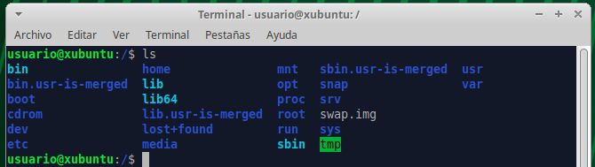
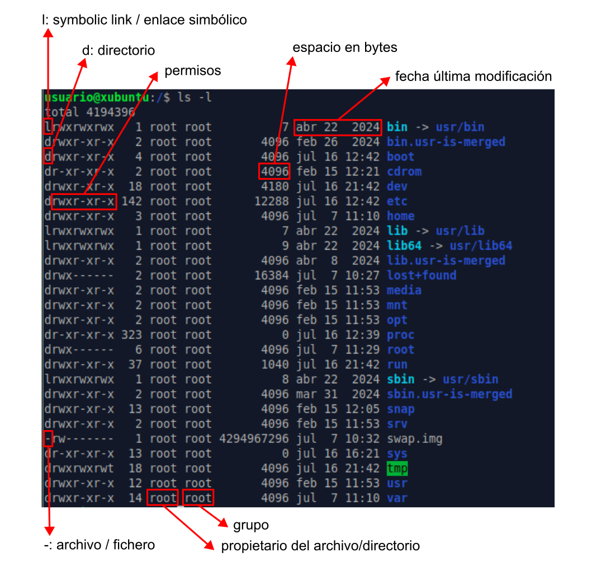

# Índice <a name="indice"></a>

1. [Abrir el terminal](#terminal)
2. [¿Cómo obtener ayuda sobre un comando?](#ayuda)  
3. [Comandos _bash_](#comandos)  
	3.1. [Listar de archivos y directorios](#archivos)  
	3.2. [Alias e historial](#alias)  
	3.3. [Manejo de directorios y archivos](#directorios)  
	3.4. [Manipulación de archivos](#ficheros)  

	<!--
	3.5. [Scripting básico](#scripts)
	3.6. [Conexión a un servidor](#server)
	-->

[Resumen Comandos](#resumen)

***

# 1. Abrir el terminal <a name="terminal"></a> 

Abrimos la caja de aplicaciones (botón en el parte superior izquierda) y pinchamos en "Emulador de Terminal":  
<p align="center" width="100%">
	
</p>

<p align="center">Terminal</p>
<p align="center" width="100%">
	
</p>

# 2. ¿Cómo obtener ayuda sobre un comando?  <a name="ayuda"></a>  

> Ir al [Índice](#indice)

Para obtener ayuda sobre el uso de cualquier comando de _bash_ (_shell_ más habitual en GNU/Linux) podemos recurrir al [manual oficial de _bash_](https://www.gnu.org/software/bash/manual/bash.html), pero también podemos obtener ayuda directamente en el terminal usando el siguiente comando:  

```bash
# Quiero saber qué opciones tiene el comando "ls"
man ls
```

<p align="center" width="100%">
	
</p>


También podemos probar lo siguiente:
```bash
ls --help
```

> [!NOTE]  
> Algunos comandos en lugar de _--help_ usan sólo _-h_.  

Si usamos el segundo comando nos muestra en el terminal (salida estándar o _stdout_) todo el texto de la ayuda completo y tendremos que ir subiendo para buscar la información que buscamos. Sin embargo, con _mam ls_ la ayuda se muestra poco a poco de modo que pulsado las flechas del teclado (o también la barra espaciadora) podremos ir avanzando en el texto de la ayuda. Para salir debemos pulsar "q" o _ctrl+c_ (cancelar un proceso). 

Otra opción sería usar el comando _whatis_ que nos devuelve una muy breve reseña de en qué consiste el comando:

```bash
whatis ls
# Salida: ls (1) - list directory contents
```

Una herramienta muy útil online es [explainshell.com](https://explainshell.com/) donde podemos poner el comando completo que no entendemos (con sus parámetros/opciones) y nos explicada cada parte de éste de una manera bastante visual:  

<p align="center" width="100%">
	
</p>

Finalmente, todo buen "Bioinformático" copia y pega el comando (o el mensaje de error de algún comando) en _google_ para encontrar la solución navegando por las distintas páginas. Pero más recientemente, las herramientas de inteligencia artificial (ChatGPT, Gemini, Copilot, etc.) nos permiten obtener la misma ayuda sin necesidad de navegar por varias páginas hasta encontrar la solución (pero hay que tener unos conocimientos mínimos para entender si lo que nos está diciendo es correcto o no).  

<p align="center" width="100%">
	
</p>

# 3. Comandos _bash_ <a name="comandos"><a/>  

[Índice](#indice)

La mayoría de las distribuciones de GNU/Linux utilizan _bash_ como _shell_ pero existen muchas otras como _tsch_, _zsh_, _sh_, _ksh_, etc. En Mac, desde que utilizan sus propios procesadores (M1, M2, etc.) utilizan por defecto _zsh_, que se puede cambiar por _bash_, aunque la mayoría de los comandos son iguales en todas las _shell_. 


## 3.1. Listar de archivos y carpetas <a name="archivos"><a/>  

> Ir al [Índice](#indice)

### _ls_ (_list_)

Este comando permite ver/listar los archivos/ficheros y las carpetas/directorios que hay en la ubicación actual:  

```bash
ls
```
<p align="center" width="100%">
	
</p>

En la mayoría de las _shells_ actualmente los archivos y directorias se colorean de manera diferente (también los enlaces simbólicos o accessos directos, ver más abajo para saber qué son).  

Pero si no es así y queremos ver los archivos y carpetas coloreados diferencialmente debemos usar la siguiente opción:  

```bash
ls --color=auto

# En Mac sería: ls -G
```

Si queremos obtener más información de los archivos y directorios podemos utilizar la opción _-l_ que además nos proporciona un formato tipo tabla más fácil de visualizar:  

```bash
ls -l
```
<p align="center" width="100%">
	
</p>


El espacio que ocupan los archivos por defecto se nos indica en bytes, pero si queremos que se indique de una manera más comprensible podemos añadir la opción _-h_:

```bash
ls -l -h 

# También podemos juntar las opciones

ls -lh
```
<p align="center" width="100%">
	
</p>

Si queremos ordenar los archivos por su fecha de modificación (más reciente a más antiguo) podemos utilizar la opción _-t_:

```bash
ls -lht
```

<p align="center" width="100%">
	
</p>

Si queremos que el orden sea el inverso (más antiguo a más reciente) añadimos la opción _-r_:

```bash
ls -lhtr
```

<p align="center" width="100%">
	
</p>

Lo que nos muestra el comando _ls_ con las opciones que hemos visto hasta ahora son solo los archivos y directorios visibles, sin embargo, hay muchos otros archivos o directorios ocultos, cuyo nombre empieza por "." que generalmente no vemos, y que conviene no tocar si no tenemos mucha experiencia con GNU/Linux. Para ver los archivos y directorios ocultos usaremos la opción _-a_:

```bash
ls -lha
```

<p align="center" width="100%">
	
</p>

<a name="dir_especiales"><a/>
Aquí quiero que veamos dos directorios especiales que existen dentro de todos los directorios:

- Directorio ".": hace referencia al propio directorio en el que nos encontramos.  
- Directorio "..": hace referencia al directorio superior (_parent_) que nos permitirá cambiar a este.  

La utilidad de estos dos directorios especiales los veremos en el siguiente apartado.  

Otro archivo oculto interesante es _.profile_ o _.bashrc_ donde, cuando tiene más experiencia, puedes incluir instrucciones que se ejecutarán al arrastar el terminal.  

> Si queremos crear un fichero oculto por la razón que sea, simplemente tenemos que cambiarle el nombre para que empiece por ".".  

## 3.2 Alias e historial <a name="alias"><a/>  

> Ir al [Índice](#indice)

En el caso del comando _ls_, que es un comando muy utilizado, si queremos usar varias de las opciones que hemos visto, puede ser un poco tedioso escribirlo todas las veces (_ls -lh --color=auto_). Afortunadamente, en casi todos los sistemas basado en Linux tenemos la opción de pulsar la flecha hacia arriba para ver los comandos que hemos escrito anteriormente (con posibilidad de editarlos si había algún error). Esto es lo que se conoce como historial, que también podemos verlo escribiendo _history_. 

```bash
history
```

<p align="center" width="100%">
	
</p>

Podemos copiar comandos del historial para volver a usarlos. 

> [!IMPORTANT]
> Para copiar y pegar en el terminal no se usa _**ctrl+c**_ y _**ctrl+v**_ (principalmente porque _**ctrl+c**_ está reservado para cancelar algún comando en ejecución). Podemos usar el botón derecho del ratón y darle a copiar/pegar en el menú que aparece o podemos usar _**ctrl+shift+c**_ para copiar y _**ctrl+shift+v**_ para pegar (si lo que copiamos y pegamos tienes varias líneas aparecerá una ventana que nos preguntará si estamos seguros).  

Además del historial, podemos crear un _alias_ (es como una especie de acceso directo o atajo). Tendremos que decidir un nombre para nuestro comando abreviado (por ejemplo, yo voy a usar la letra "l":

```bash
alias l='ls -lh --color=auto'
```

> [!IMPORTANT]
> Hay que tener cuidado al elegir el nombre de los alias para evitar usar algún termino que ya exista para otro comando.  

De este modo cada vez que yo ejecute _l_ en realidad estaré ejecutando _ls -lh --color=auto_. Sin embargo, cuando cerremos el terminal y lo volvamos a abrir el alias habrá desaparecido. Para hacerlo permanente habrá que meter esta instrucción en el fichero _.bashrc_ (en otras _shells_ este fichero puede llamarse de manera diferente: _.tcshrc_, _.zhrc_, etc.). Estos ficheros se denominan _ficheros de iniciación_ y contienen instrucciones esenciales para el funcinamiento de la _shell_ como la localización de los comandos, librerías y binarios que estamos ejecutando. Estos ficheros son leidos cuando iniciamos una sesión en el terminal.  

Para añadir una insctrucción en _.bashrc_ vamos a utilizar un editor de texto que viene integrado en el terminal: _nano_.  

```bash
nano .bashrc
```
<p align="center" width="100%">
	
</p>

Este fichero contiene muchas instrucciones que no vamos a tocar. Simplemente iremos al final del fichero, usando las fechas del teclado, y añadiremos al final el alias que queremos usar:  

<p align="center" width="100%">
	
</p>

Para salir/guardar los cambios pulsamos _**ctrl+x**_, nos preguntará si queremos guardar los cambios, pulsaremos "y" y luego nos pedirá confirmar el nombre del fichero pulsando "enter".  

Entonces habremos salido del editor, pero aún no se habrán actualizado los cambios que hemos introducido en el fichero. Para actualizarlo podemos hacer un _source .bashrc_, que básicamente lee el fichero y ejecuta los comando que hay en él o bien cerramos el terminal y lo volvemos a abrir, ya que estos ficheros se leen/ejecutan al arrascar el terminal. Ahora ya tenemos el alias disponible y no tendremos que volver a escribir todo el comando de nuevo. Obviamente podemos tener todos los alias que queramos, por ejemplo, otro alias interesante sería _alias ll='ls -lhtra --color=auto'_ que nos permite ver todos los ficheros, incluidos los ocultos ordenados por fecha de manera inversa. Esto es útil para ver los ficheros/directorios nuevos que se hayan creado como parte de un programa/comando que estemos ejecutando.  

## 3.3. Manejo de directorios y archivos <a name="directorios"><a/>  

> Ir al [Índice](#indice)

Antes de empezar a aprender los comandos necesarios para movernos y manejar directorios es necesario que conozcamos la estructura de directorios de Linux. 

Los sistemas GNU/Linux tienen un patrón bastante estricto y específico al respecto de la organización jerárquica de los directorios, definido por _Filesystem Hierarquy Standard_ (_FHS_), para evitar problemas de compatibilidad entre distribuciones y conseguir un sistema operativo sólido.  

La base de esta jerarquía es el directorio raíz (_root_), que se representa con el signo «/», y contiene al resto de directorios/archivos. 

<p align="center" width="100%">
	
</p>

Dentro del directorio raíz («/») encontramos varios directorios que posee funciones específicas para el sistema operativo. Los principales se describen en la siguiente tabla:


| Directorio  | Descripción                                                                                                                         |
|-------------|-------------------------------------------------------------------------------------------------------------------------------------|
| /bin        | aplicaciones binarias importantes                                                                                                   |
| /boot       | Ficheros de configuración del arranque, núcleos y otros ficheros necesarios para el arranque (boot) del equipo.                     |
| /dev        | los ficheros de dispositivo                                                                                                         |
| /etc        | ficheros de configuración, scripts de arranque, etc.                                                                                |
| /home       | directorios personales (home) para los diferentes usuarios.                                                                         |
| /lib        | librerías del sistema (libraries)                                                                                                   |
| /media      | particiones montadas (cargadas) automáticamente en el disco duro y medios (media) extraíbles como CDs, cámaras digitales, etc.      |
| /mnt        | sistemas de archivos montados manualmente en el disco duro.                                                                         |
| /opt        | proporciona una ubicación donde instalar aplicaciones opcionales (de terceros)                                                      |
| /proc       | directorio dinámico especial que mantiene información sobre el estado del sistema, incluyendo los procesos actualmente en ejecución |
| /root       | directorio personal del usuario root (superusuario); también llamado "barra-root".                                                  |
| /sbin       | binarios importantes del sistema                                                                                                    |
| /sys        | archivos del sistema (system)                                                                                                       |
| /tmp        | temporary files                                                                                                                     |
| /usr        | aplicaciones y archivos a los que puede acceder la mayoría de los usuarios                                                          |
| /var        | archivos variables como archivos de registros y bases de datos                                                                      |  

Para más detalles ver: [Linux Fundation](https://www.linuxfoundation.org/blog/blog/classic-sysadmin-the-linux-filesystem-explained), [Ayuda Linux](https://ayudalinux.com/estructura-sistema-archivos/) y [Ayuda Ubuntu](https://help.ubuntu.com/kubuntu/desktopguide/es/directories-file-systems.html).  

En este punto no es muy importante conocer los detalles de cada uno de estos directorios, ya que para hacer modificaciones en estos se requieren conocimientos más avanzados. 

El único directorio en el que nosotros vamos a trabajar en _home_, que contiene los archivos/directorios de cada uno de los usuarios (un mismo equipo con Linux puede tener más de un usuario definido, igual que en otros sistemas operativos). Cuando arrancamos el terminal o el visor de archivos generalmente nos llevará a la carpeta de nuestro usuario dentro de la carpeta _home_, por ejemplo, _/home/usuario/_. Para saber el directorio en el que nos encontramos podemos utilizar el comando _pwd_:

```bash
pwd

# Salida: /home/usuario
```

### Moverse entre directorios

Para cambiar de directorio utilizaremos el comando _cd_ (_change directory_). Por ejemplo, si queremos acceder a la carpeta _Descargas_ dentro de nuestra carpeta de usuario podemos escribir:

```bash
cd Descargas
```

Tras ello podemos comprobar con _pwd_ que ahora estamos en la carpeta _/home/usuario/Descargas/_.  

¿Qué ocurre si en lugar de _Descargas_ nos equivocamos y escribimos el nombre mal por error?  

```bash
cd descargas

# Salida: bash: cd: descargas: No existe el archivo o el directorio
```
> [!IMPORTANT]
> Efectivamente, Linux distingue entre mayúsculas y minúsculas, y por lo tanto, la carpeta _descargas_ no existe, y así nos lo indica el comando cuando lo ejecutamos.  

Para evitar este tipo de errores al escribir podemos hacer uso del tabulador (tecla TAB). Simplemente escribiendo las primeras letras del nombre de un archivo o directorio el terminal completará el nombre si sólo hay una opción, si hubiera más, pulsando TAB dos veces, te mostrará los nombre disponibles en el directorio actual. En el segundo caso podemos añadir alguna letra más del nombre y pulsar TAB para que se complete el nombre. Esto se conoce como _autocompletado_, y es muy útil para evitar errores.  

Bien, ahora que estamos en _/home/usuario/Descargas/_, ¿cómo vuelvo hacia atrás, a la carpeta anterior?  
Para ello usaremos uno de los 2 directorios especiales que hay dentro de cada directorio que vimos antes (ver [aquí](#dir_especiales)). En este caso usaremos el directorio ".." que hace referencia al directorio superior (_parent_), el que esta justo encima en la jerarquía:

```bash
cd ..
```

Ahora, si usamos _pwd_, podremos comprobar que hemos vuelto a _/home/usuario/_, y por lo tanto, hemos salido de la carpeta _Descargas_. 

Si queremos movernes varios niveles al mismo tiempo podemos encaderar la ruta a la que queremos entrar, Por ejemplo:

```bash
cd snap/firefox/common/
```

Y para ir hacia atrás varios directorios basta con encaderar ".." así:

```bash
cd ../../..
```

De este modo hemos ido 3 directorios hacia abajo en el jerarquía, hasta llegar a _/home/usuario/snap/firefox/common/_ y luego hemos subido 3 directorio para volver a _/home/usuario/_. 

Si ejecutamos el comando _cd_ sin ningún argumento (en este caso una ruta de un directorio) nos llegará a la carpeta _/home/usuario/_, que generalmente se refiero como _home_. También es posible hacer lo mismo con el caracter especial «~» (virgulilla, alt+4):

```bash
cd ~

# o podríamos usar este comodín en una ruta de directorios si no estamos en home

cd ~/snap/firefox/common/

# Esto es lo mismo que 
cd /home/usuario/snap/firefox/common/

# ~ = /home/usuario/

```

La otra carpeta especial que vimos anteriormente (".") hace referencia al directorio en el que estamos, es como decirle a la _shell_ que estamos aquí. Por lo tanto, podemos especificar un poco más al cambiar de directorio, borrar un directorio o un fichero, etc., añadiendo este punto en las instrucciones:

```bash
# Ejemplos- 
cd ./bia
rm -r ./bia
rm ./mi_fichero.txt
```
Esto no parece muy útil ahora mismo (a la par que inecesario), pero lo será necesario más adelante.

Por otro lado, si en lugar de movernos con _cd_, lo único que queremos es ver que hay en una carpeta podemos usar el comando _ls_ con la ruta que queremos explorar:

```bash
ls -lh snap/firefox/
# o
ls -lh ./snap/firefox/
# o
ls -lh ~/snap/firefox/
# o
ls -lh /home/usuario/snap/firefox/

# Todas son equivalentes
```
De esta manera veremos el contenido de la carpeta sin movernos de donde estamos.  

### Crear y borrar archivos y carpetas

Ahora vamos a crear un directorio con el comando _mkdir_ (_make directory_):

```bash
# vamos a home
cd
#
mkdir bia
```

Para eliminarlo usaremos el comando _rmdir_ (_remove directory_):
```bash
rmdir bia
```

> [!NOTE]
> _rmdir_ sólo sirve para eliminar directorios que estén vacíos.  

Vamos ahora a crear el directorio de nuevo, nos meteremos en este, y vamos a crear un fichero en su interior con el comando _touch_ (crea un fichero vacío con el nombre especificado) y un subdirectorio:

```bash
mkdir bia
cd bia
touch mi_fichero.txt
mkdir sub_bia
cd ..
```
> [!NOTE]
> Es recomendable no usar espacios, tildes o caracteres especiales (¿?!$.., salvo "-" o "\_") en los nombres de archivos o directorios en Linux. 

Si ahora intentamos borrar el directorio con _rmdir_ nos a dará el siguiente error:

`rmdir: fallo al borrar 'bia': El directorio no está vacío`

Podemos entrar en el directorio _bia_ y borrar el archivo _mi_fichero.txt_ con el comando _rm_ (_remove_) y el subdirectorio _sub_bia_ con _rmdir_ (que está vacío)...

```bash
cd bia
rm mi_fichero.txt
rmdir sub_bia
cd ..
```

O, podemos hacer uso de la _-r_ del comando _rm_ que elimina el contenido de un directorio de manera recursiva, es decir, entra en el directorio y todos los subdirectorio y elimina todas los archivos y directorios que encuentre.  

```bash
rm -r bia
```

> [!WARNING]
> Lo que se borra en el terminal (a través de la _shell_) se elimina definitivamente, no va a ninguna papelera de reciclaje de la que podemos recuperar lo archivos o directorios. Por lo tanto, hay que estar muy seguro cuando se borra algo. Para evitar errores podemos usar la opción _-i_ de _rm_ para que nos pregunte antes de borrar si estamos seguros (_rm -i mi_fichero.txt_). Podríamos incluir un alias en _.bashrc_ como ya hicimos antes para que siempre nos pregunta y evitar problemas (_alias rm='rm -i'_).  


### Mover/renombrar y copiar archivos y directorios

Antes de empezar necesitamos crear algunos archivos y directorios:

```bash
cd
mkdir bia
cd bia
mkdir sub_bia
mkdir sub_bia_2
touch mi_fichero.txt
touch ./sub_bia_2/mi_fichero_2.txt
cd ~/bia
```

Podemos usar el comando _tree_ para ver la estructura del directorio que hemos creado:
```bash
tree .

# Salida:
# .
#├── mi_fichero.txt
#├── sub_bia
#└── sub_bia_2
#    └── mi_fichero_2.txt
```

Ahora vamos a hacer algunos movimientos. 

Vamos a mover _mi_fichero.txt_ a la carpeta _sub_bia_. Para ello usaremos el comando _mv_ (_move_):
```bash
mv mi_fichero.txt sub_bia

# mv ./mi_fichero.txt ./sub_bia
# También podemos añadir una barra (slash) al final de sub_bia para especificar que es un directorio
# mv ./mi_fichero.txt ./sub_bia/

tree .
# .
# ├── sub_bia
# │   └── mi_fichero.txt
# └── sub_bia_2
#     └── mi_fichero_2.txt
```

Para mover directorios se hace exáctamente igual. Vamos a mover _sub_bia_ dentro de _sub_bia_2_:

```bash
mv sub_bia sub_bia_2
# mv ./sub_bia ./sub_bia_2
# mv ./sub_bia/ ./sub_bia_2/
tree .
# .
# └── sub_bia_2
#     ├── mi_fichero_2.txt
#     └── sub_bia
#         └── mi_fichero.txt
```

Básicamente el comando _mv_ toma 2 argumentos (o más, ver más abajo); lo que queremos mover y dónde queremos moverlo.  

¿Cómo muevo la carpeta _sub_bia_ fuera de _sub_bia_2_ donde estaba antes? Hay varias opciones:

```bash
# Escribiendo las rutas completas (o rutas absolutas)
mv /home/usuario/bia/sub_bia_2/sub_bia/ /home/usuario/bia/

# Usando la carpeta especial "." (desde /home/usuario/bia/, es decir, le decimos que mueva la carpeta a "aquí")
mv sub_bia_2/sub_bia .
# mv ./sub_bia_2/sub_bia .
# mv ./sub_bia_2/sub_bia/ .

# Usando la carpeta especial ".." (desde /home/usuario/bia/sub_bia_2/, es decir, le decimos que mueva la carpeta a la carpeta superior o parent)
cd sub_bia_2
mv sub_bia ..
# mv ./sub_bia ..
# mv ./sub_bia/ ..
```
Con ficheros, en lugar de directorios el comando _mv_ funciona exáctamente igual. También podemos mover más de una cosa a la vez. Para ello, le vamos a indicar varias cosas que queremos mover y por último el destino. Es decir, en este caso, el comando tomará más argumentos, siendo el último el destino. Vamos a mover los ficheros _mi_fichero.txt_ (dentro de _sub_bia_) y _mi_fichero_2.txt_ (dentro de _sub_bia_2_) a la carpeta superior (_bia_):

```bash
cd /home/usuario/bia
mv sub_bia/mi_fichero.txt sub_bia_2/mi_fichero_2.txt .
# mv /home/usuario/bia/sub_bia/mi_fichero.txt /home/usuario/bia/sub_bia_2/mi_fichero_2.txt /home/usuario/bia
tree .
#.
#├── mi_fichero_2.txt
#├── mi_fichero.txt
#├── sub_bia
#└── sub_bia_2
```

¿Cómo cambiamos el nombre a un archivo/directorio? 

Usando el comando _mv_, pero en lugar de ponerle un destino distinto al actual le indicamos el nuevo nombre que queremos darle. Obviamente este nuevo nombre debe ser único, que no exista un archivo o directorio con ese nombre, porque en el caso de existir lo que estamos haciendo en mover el archivo/directorio o en el peor de los casos estaremos sobre-escribiendo un archivo que ya existe. Vamos a renombrar _mi_fichero.txt_ a _mi_archivo.txt_:

```bash
mv mi_fichero.txt mi_archivo.txt
tree .
#.
#├── mi_fichero_2.txt
#├── mi_archivo.txt
#├── sub_bia
#└── sub_bia_2
```

Ahora vamos a renombrar el directorio _sub_bia_:

```bash
mv sub_bia sub_bia_1
tree .
#.
#├── mi_fichero_2.txt
#├── mi_archivo.txt
#├── sub_bia_1
#└── sub_bia_2
```

Las operaciones de renombrado y movimiento se pueden combinar, es decir, podemos mover y renombrar un fichero/directorio a la vez:

```bash
mv mi_fichero_2.txt ./sub_bia_2/mi_archivo_2.txt

tree .
#.
#├── mi_archivo.txt
#├── sub_bia_1
#└── sub_bia_2
#    └── mi_archivo_2.txt
```

Tomamos _mi_fichero_2.txt_ y le damos un nuevo destino en _sub_bia_2_ con un nuevo nombre _mi_archivo_2.txt_.  

Para copiar archivos o carpetas usaremos el comando _cp_ (_copy_) de manera muy similar a cómo hemos usado el comando _mv_. En general a _cp_ debemos pasarle 2 argumentos, aquello que queremos copias (archivos or directorios) y dónde queremos copiarlos.  

Por ejemplo, vamos a copiar el fichero _mi_archivo.txt_ al interior de la carpeta _sub_bia_1_:

```bash
cp mi_archivo.txt sub_bia_1

tree .
#.
#├── mi_archivo.txt
#├── sub_bia_1
#    └── mi_archivo.txt
#└── sub_bia_2
#    └── mi_archivo_2.txt
```

¿Cómo hago una copia del fichero _mi_archivo.txt_ en el mismo directorio? Obviamente no podrá llamarse igual, porque entonces no estaremos haciendo una copia. Entonces, en lugar de darle un destino como segundo argumento, tendremos que darle un nuevo nombre (que no ha de existir en el directorio):

```bash
cp mi_archivo.txt mi_archivo_3.txt

tree .
#.
#├── mi_archivo_3.txt
#├── mi_archivo.txt
#├── sub_bia_1
#    └── mi_archivo.txt
#└── sub_bia_2
#    └── mi_archivo_2.txt
```

¿Cómo copiamos directorios? Usamos la misma estrategia, pero debemos añadir al comando _cp_ la opción _-r_ (_recursive_), que copiará el directorio y todo su contenido:

```bash
cp -r sub_bia_1 sub_bia_2

tree .
#.
#├── mi_archivo_3.txt
#├── mi_archivo.txt
#├── sub_bia_1
#│    └── mi_archivo.txt
#└── sub_bia_2
#    ├── mi_archivo_2.txt
#    └── sub_bia_1
#        └── mi_archivo.txt
```

Con el comando _cp_ podemos copiar y renombrar al mismo tiempo, parecido a como hicimos con _mv_, además del destino en el que queremos copiar el archivo/directorio, debemos incluir el nuevo nombre:

```bash
cp -r sub_bia_1 sub_bia_2/sub_bia_3

tree .
#.
#├── mi_archivo_3.txt
#├── mi_archivo.txt
#├── sub_bia_1
#│    └── mi_archivo.txt
#└── sub_bia_2
#    ├── mi_archivo_2.txt
#    └── sub_bia_1
#        └── mi_archivo.txt
#    └── sub_bia_3
#        └── mi_archivo.txt
```

Como en _mv_ podemos procesar, en el caso de _cp_ copiar, varios archivos/directorios al mismo tiempo, incluyendo siempre el destino como último argumento del comando:


```bash
cp mi_archivo.txt mi_archivo_3.txt sub_bia_2

tree .
#.
#├── mi_archivo_3.txt
#├── mi_archivo.txt
#├── sub_bia_1
#│    └── mi_archivo.txt
#└── sub_bia_2
#    ├── mi_archivo_2.txt
#    ├── mi_archivo_3.txt
#    ├── mi_archivo.txt
#    └── sub_bia_1
#        └── mi_archivo.txt
#    └── sub_bia_3
#        └── mi_archivo.txt
```

### Wildcards

Si quisieramos mover o copiar muchos archivos/directorios ponerlos todos como argumentos puede ser bastante tedioso. Imaginad que queremos mover 20 archivos, tendríamos que poner 20 argumentos en el comando y luego el destino. Para hacer esto más sencillo tenemos lo que se conoce como _wildcards_, que podríamos traducir como comodines. Vamos a ver los 2 más importantes: «\*» y «?» (para más info ver [aquí](https://rsg-ecuador.github.io/unix.bioinfo.rsgecuador/content/Curso_basico/03_Manejo_terminal/5_wildcards.html)). 

El comodín «?» sirve para sustituir un único caracter por cualquier cosa. Por ejemplo, si quieramos mover los archivos _mi_archivo_2.txt_ y _mi_archivo_3.txt_ dentro de la carpeta _sub_bia_2_ lo podríamos hacer así:

```bash
cd sub_bia_2
mv mi_archivo_?.txt sub_bia_1
cd ..

tree .
#.
#├── mi_archivo_3.txt
#├── mi_archivo.txt
#├── sub_bia_1
#│    └── mi_archivo.txt
#└── sub_bia_2
#    ├── mi_archivo.txt
#    ├── sub_bia_1
#    │    ├── mi_archivo_2.txt
#    │    ├── mi_archivo_3.txt
#    │    └── mi_archivo.txt
#    └── sub_bia_3
#        └── mi_archivo.txt
```

En este ejemplo, los nombres sólo se diferencia en un caracter, podemos añadir tanto «?» como sean necesario (ex: _mi_archivo??.txt_ permitiría copiar todos los fichero tipo _mi_archivo_01.txt_, _mi_archivo_02.txt_, _mi_archivo_xx.txt_, etc., siempre son 2 caracteres en la zona de los 2 comodines).  


El segundo comodín, «\*», permite sustituir cualquier caracter y cualquier número de caracteres, lo que lo hace más potente que el primero. Vamos a crear una nueva carpeta y vamos a copiar todos los archivos acabados en _.txt_ de la carpeta _sub_bia_2/sub_bia_1_:

```bash
mkdir sub_bia_4
cp ./sub_bia_2/sub_bia_1/*.txt sub_bia_4

tree .

#.
#├── mi_archivo_3.txt
#├── mi_archivo.txt
#├── sub_bia_1
#│    └── mi_archivo.txt
#├── sub_bia_2
#│    ├── mi_archivo.txt
#│    ├── sub_bia_1
#│    │    ├── mi_archivo_2.txt
#│    │    ├── mi_archivo_3.txt
#│    │    └── mi_archivo.txt
#│    └── sub_bia_3
#│        └── mi_archivo.txt
#└── sub_bia_4
#    ├── mi_archivo_2.txt
#    ├── mi_archivo_3.txt
#    └── mi_archivo.txt
```

También podemos usar los comodines (_wildcards_) para eliminar varios archivos/directorios al mismo tiempo:

```bash
rm ./sub_bia_4/*.txt

tree .

#.
#├── mi_archivo_3.txt
#├── mi_archivo.txt
#├── sub_bia_1
#│    └── mi_archivo.txt
#├── sub_bia_2
#│    ├── mi_archivo.txt
#│    ├── sub_bia_1
#│    │    ├── mi_archivo_2.txt
#│    │    ├── mi_archivo_3.txt
#│    │    └── mi_archivo.txt
#│    └── sub_bia_3
#│        └── mi_archivo.txt
#└── sub_bia_4
```

### Enlaces simbólicos (_symbolic links_)

Si trabajamos con archivos de secuenciación masiva, a veces, lo archivos son muy grandes (≥1Gb), y dado que contienen los datos fundamentales de nuestro experimento, es mejor no manipularlos directamente, ni trabajar en el directorio en el que los tenemos, para evitar borrados accidentales. Obviamente podríamos crear una copia de los archivos, pero eso podría suponer problemas de almacenamiento en el disco duro, que podría llenarse e impedir realizar cualquier análisis for falta de espacio. Para solucionar esto (y otros problemas similares en otras áreas) existe lo que se conoce como **Enlaces simbólicos**. Son similares a los _accesos directos_ en otros sistemas operativos como Windows. Básicamente crearemos un enlace, no una copia, del archivo en otro lugar para poder trabajar con lo archivos. Si accidentalmente barrásemos este enlace simbólico, no pasaría nada, porque el archivo original estaría protegido en otro lugar. Para crear los enlaces simbólicos usaremos el comando _ls_. Vamos crear algunos directorios y archivos para el ejemplo:

```bash
cd
mkdir datos
cd datos
touch secuencias_super_importantes.fastq
cd ..
```

Ahora tenemos nuestros datos, que hemos obtenido con esfuerzo y probablemente con un coste elevado, y no queremos perderlos. Para trabajar con los datos haremos un enlace simbólico al archivo en otro directorio separado:

```bash
cd
mkdir analisis_datos
cd analisis_datos
ln -s /home/usuario/datos/secuencias_super_importantes.fastq .
```
<p align="center" width="100%">
	
</p>

Como vemos los enlaces simbólicos se representa con un color diferente (_ls -lh --color=auto_) y nos indica dónde está el fichero original.

Hemos usado la opción _-s_ que significa _soft_, que es el tipo más habitual y para este curso no vamos a necesitar de otros tipos. Si queréis conocer más sobre los enlaces simbólicos podéis leerlo [aquí](https://rm-rf.es/diferencias-entre-soft-symbolic-y-hard-links/). 

También podemos ver que hemos puesto la ruta absoluta (desde la raiz «/»), que es lo más recomendable, aunque en Linux se podrían usar rutas relativas a nuestra posición actual (usando «..») y añadiendo la opción _-r_. Además, podemos nombrar nuestro enlace de una manera diferente al archivo original, dándole un nuevo nombre en el destino:

```bash
ln -sr ../datos/secuencias_super_importantes.fastq ./secuencias.fastq

tree .
#.
#├── secuencias.fastq -> ../datos/secuencias_super_importantes.fastq
#└── secuencias_super_importantes.fastq -> /home/usuario/datos/secuencias_super_importantes.fastq
```

Ahora podemos trabajar con los enlaces simbólicos como si fueran los archivos originales, sin miedo a perder la información, pues si los borramos, solo borramos el enlace, y además no ocupan casi nada en el disco duro, por lo que estamos ahorrando mucho espacio.  

> [!WARNING]
> En Mac, que es Linux, no existe la opción _«-r»_ por lo que hay que utilizar siempre rutas absolutas.  


## 3.4. Manipulación de archivos <a name="ficheros"><a/>  

> Ir al [Índice](#indice)

Lo primero que debemos saber es que hay 2 grandes tipos de archivos que nos conciernen en este punto: 

- **Texto plano**: el contenido del archivo es directemente legible por un humano. Un ejemplo de este tipo de archivos sería los de tipo _txt_, _csv_, _tsv_ y muchos otros que se usan en secuenciación masiva para almacenar las secuencias (_fasta_, _fastq_, _sam_, _vcf_, etc.), que los veremos más adelante.  
- **Binarios**: el contenido del archivo sólo es entendible por un humano si se usa un programa especial para abrirlo. Un ejemplo sería un archivo de Microsotf Word (_docx_), cuyo contenido sólo es legible si usamos un editor de texto, ya sea el propio Microsoft Word u otro compatible (ex_ LibreOffice). También son parcialmente binarios los archivos _pdf_, _png_, _jpeg_, etc. Si trataramos de ver el contenido de estos ficheros con un editor de texto plano sólo veríamos una sucesión de caracteres ininteligibles para nosotros/as, pero perfectamente entendibles por un ordenador.  

Otra cosa importante que mencionar es que las extensiones de los archivos (_.txt_, _.pdf_) sólo sirven para que el sistem operativo sepa con qué programa específico debe abrirlos.  

La mayoría de los archivos que vamos a manejar serán de tipo _texto plano_ y a veces estarán comprimidos para ocupar menos espacio (lo que los convierte en binarios).  

Ya hemos visto antes cómo crear un archivo vacío con el comando _touch_, pero hay otra formas de crear archivos, principalmente redirigiendo la salida estándar (_stdout_) de algún comando.  

Cuando ejecutamos un comando en el terminal, si este genera algún tipo de salida, se muestra en la pantalla del terminal, siendo esta la salida estándar por defecto. Utilizando el operados «>» podemos redirigir lo que se muestra por pantalla a un archivo. Para este ejemplo usaremos el comando _echo_ que muestra por pantalla el texto que le demos (también puede mostrar el contenido de una variable):

```bash
cd
cd bia
echo "Esto es una prueba" > nuevo_archivo.txt
```

Ahora podemos comprobar con _ls_ o _tree_ que hemos creado un nuevo archivo. En este caso, a diferencia de los anteriores en los que usamos el comando _touch_ para crearlos, el nuevo archivo no está vacío, lo que podemos comprobar por el espacio que ocupa:

<p align="center" width="100%">
	
</p>

Si quisiéramos añadir algún texto a nuestro archivo de manera rápida podríamos usar también el comando _echo_, pero ahora, en lugar de usar al operador «>», que crearía un nuevo archivo sobre-escribiendo el que ya existe si usamos el mismo nombre, usaremos el operador «>>» que añade el nuevo contenido al archivo existente (si usamos este operador con el nombre de un fichero que no existe, se crear también y se añade el contenido):

```bash
echo "Voy a añadir nueva información" >> nueva_archivo.txt
```

Otra forma de crear, o editar, un archivo desde el terminal es usando diversos editores de texto plano que vienen ya pre-instalador en la _shell_. Los más habituales son _vim_, más antiguo y difícil de manejar pues debes conocer los atajos de teclado para operar, y _nano_ que es más intuitivo. Vamos a ver y editar nuestro archivo con _nano_:

```bash
nano nuevo_archivo.txt

# Añadimos o modificamos lo que queremos
# Para guardar pulsamos ctrl+o
# Para salir pulsamos ctrl+x
```

<p align="center" width="100%">
	
</p>


Como vemos en la parte inferior del editor tenemos una chuleta con los comandos que podemos usar, como guardar, cerrar, cortar y pegar, etc. La tecla _ctrl_ está simbolizada como «^» para ahorrar espacio. 


En lugar de editar un archivo que ya existe podemos crear uno nuevo escribiendo el nombre de un nuevo archivos que no exista:

```bash
nano nuevo_archivo_2.txt
```

Sin embargo, generalmente los archivos que vamos a manejar no son tan simples, por lo que para aprender los comandos más habituales para ver el contenido y analizar el contenido de un fichero de texto plano vamos a utilizar el archivo «countries.csv» (modificado de [aquí](https://simplemaps.com/data/countries)) y que tenéis disponible en la carpeta _/home/usuario/Documentos/_. Para no borrar accidentalmente el archivo vamos a hacernos una copia en una nueva carpeta:

```bash
cd
mkdir countries
cp /home/usuario/Documentos/countries.tsv countries
cd countries
```

Vamos a echar un vistazo al contenido del archivo con el comando _less_, que no muestra el contenido en trozos del tamaño de la ventana del terminal, que podremos ir moviendo con las fechas o con la barra de espacio. 

```bash
less countries
```

Quizás cuesta un poco, pero se puede intuir que estamos ante una tabla, lo que ya se podía intuir por su extensión _tsv_ (_tab separated values_, valores separados por tabuladores). Existe otro tipo de tablas en formato texto plano que sería el _csv_ (_comma separated values_, valores separados por comas), siendo ambos formatos importables en Microsoft Excel (o LibreOffice).  

En la visualización en el terminal a veces las columnas están un poco desfasadas dependiendo el tamaño del texto de cada "celda", por lo que no siempre es fácil verlo. En cualquier caso, estamos ante una tabla de paises con varios datos de cada uno de ellos (moneda usado, población, etc.). En la siguiente tabla podemos ver algo mejor las primers líneas del archivo.  

| country       | currency             | population | density | area     | gdp      | language   | driving_side | continent     | un_member | religion     |
|---------------|----------------------|------------|---------|----------|----------|------------|--------------|---------------|-----------|--------------|
| China         | Chinese Yuan         | 1413142846 | 147.2   |  9596960 | 17963170 | Chinese    | right        | Asia          |    TRUE   | No Religion  |
| India         | Indian Rupee         | 1399179585 | 425.6   |  3287263 |  3465541 | Hindi      | left         | Asia          |    TRUE   | Hinduism     |
| United States | United States Dollar |  339665118 | 34.5    |  9833517 | 25744100 | English    | right        | North America |    TRUE   | Christianity |
| Indonesia     | Rupiah               |  279476346 | 146.7   |  1904569 |  1319100 | Indonesian | left         | Asia          |    TRUE   | Islam        |
| Pakistan      | Pakistani Rupee      |  247653551 | 311.1   |   796095 |   326796 | Urdu       | left         | Asia          |    TRUE   | Islam        |
| Nigeria       | Naira                |  230842743 | 249.9   |   923768 |    15414 | English    | right        | Africa        |    TRUE   | Christianity |
| Brazil        | Brazilian Real       |  218689757 |    25.7 |  8515770 |  1920095 | Portuguese | right        | South America |    TRUE   | Christianity |
| Bangladesh    | Bangladeshi Taka     |  167184465 |  1126.1 |   148460 |   432677 | Bengali    | left         | Asia          |    TRUE   | Islam        |
| Russia        | Russian Ruble        |  141698923 |     8.3 | 17098242 |  2240422 | Russian    | right        | Europe        |    TRUE   | Christianity |

Para salir de la visualización del archivo que estamos haciendo con _less_ debemos pulsar la tecla «q» (_quit_) o _ctrl+c_ (_cancel_). 


Si sólo queremos echar un vistazo al inicio del archivo podemos usara el comando _head_, que por defecto nos muestra las primeras 10 líneas, pero que podemos modificar usando la opción _-n_ para mostrar las primeras n líneas que necesitemos:

```bash
head -n 5 countries.tsv

# country	currency	population	density	area	gdp	language	driving_side	continent	un_member	religion
# China	Chinese Yuan	1413142846	147.2	9596960	17963170	Chinese	right	Asia	TRUE	No Religion
# India	Indian Rupee	1399179585	425.6	3287263	3465541	Hindi	left	Asia	TRUE	Hinduism
# United States	United States Dollar	339665118	34.5	9833517	25744100	English	right	North America	TRUE	Christianity
# Indonesia	Rupiah	279476346	146.7	1904569	1319100	Indonesian	left	Asia	TRUE	Islam
```

_tail_ funciona igual que _head_, pero nos mostrará las n últimas líneas (por defecto 10):

```bash
tail -n 5 countries.tsv

# South Georgia and the South Sandwich Islands	Pound Sterling					English	left	Seven seas (open ocean)	FALSE	
# Heard Island and McDonald Islands				412			left	Seven seas (open ocean)	FALSE	
# Bouvet Island				49			right	Antarctica	FALSE	
# Antarctica				14200000				Antarctica	FALSE	No Religion
#
```

Como vemos, sólo nos muestra 4 líneas con contenido porque hay una última línea en blanco al final del archivo.


Podríamos combinar estos comandos, y otros, usando lo que se conoce como _pipes_, o tuberías, que básicamente permiten pasar la salida de un comando al siguiente. Por ejemplo, imaginamos que queremos copiar la información de India, que está en la tercera línea del fichero. Obviamente podríamos abrirlo con _nano_ y copiar la tercera línea, pero no siempre vamos a poder hacer esto por el tamaño de los archivos, que podrían llegar a no abrirse con _nano_ (o _vim_) o tardarían demasiado. Para hacerlo rápido podemos tomar las 3 primeras líneas con _head_ y luego pasar esas líneas a _tail_ y pedirle que nos devuelva sólo la última. Esto se ejecutaría así:

```bash
head -n 3 countries.tsv | tail -n 1

# India	Indian Rupee	1399179585	425.6	3287263	3465541	Hindi	left	Asia	TRUE	Hinduism
```

Hemos utilizado el operador «|» (_pipe_) para separar los comandos que se escribe pulsando alt+1. Veremos más adelante que podemos combinar muchos comandos usando _pipes_.  

Si quisiéramos guardar el resultado del comando anterior en un archivo se podrían añadir al final el operador «>» y darle el nombre que queramos al nuevo archivo:

```bash
head -n 3 countries.tsv | tail -n 1 > india.txt
```

En este caso no obtenemos ningún resultado por pantalla, ya que hemos redirigido la salida estándar (la pantalla del terminal) a un archivo («>») creando un nuevo archivo con la información. 

Supongamos ahora que queremos ver la información del medio de la tabla, por ejemplo Senegal. Podemos usar _less_ e ir buscando línea a línea hasta encontrar lo que buscamos o podemos usar un comando para hacerlo más rápido. En este caso vamos a utilizar el comando _grep_ que nos permite buscar texto (con o sin comodines, _wildcards_) en el contenido de un archivo. La sintaxis es sencilla, le decimos qué queremos buscar y dónde:

```bash
grep senegal countries.tsv
```

Nada, no nos devuelve nada. ¿Por qué? 

> [!IMPORTANT]
> Por que en Linux "senegal" no es lo mismo que "Senegal", es decir, Linux diferencia mayúsculas de minúsculas (en Windows y Mac esto no es así). 

Entonces podemos repetir la búsqueda con "Senegal" o bien, si no sabemos cómo está escrito en la tabla, podemos usar la opción «-i» de _grep_ que lo hace insensible a las mayúsculas/minúsculas:

```bash
grep -i senegal countries.tsv

# Senegal	West African Cfa Franc	18384660	93.5	196722	27775	French	right	Africa	TRUE	Islam
```

Ahora sí obtenemos el resultado deseado. 

Vale, pero y si no tenemos muy claro como se escribe el nombre de un país. Por ejemplo, en español Zimbabue se escribe así, pero y en inglés o en Shona (el idioma oficial de este país)... Probablemente no sea muy diferente, así que podemos hacer búsquedas con textos parciales, por ejemplo, solo "zi":

```bash
grep -i zi countries.tsv

#Brazil	Brazilian Real	218689757	25.7	8515770	1920095	Portuguese	right	South America	TRUE	Christianity
#Zimbabwe	Zimbabwean ZiG	15418674	39.5	390757	26418	English	left	Africa	TRUE	Christianity
```
Vemos que ha encontrado "zi" en 2 líneas de la tabla: Bra**zi**l y **Zi**mbabwe. 

Supongamos ahora que nos interesa saber qué paises se llaman "United lo que sea". Pero no tengo muy claro si "united" lleva una o 2 "t". Podríamos hacer la siguiente búsqueda:

```bash
grep -i unit* countries.tsv

```

Como vemos en la tabla de debajo con los resultados de la búsqueda anterior, tenemos algunos resultados de paises que su nombre no empieza por "united", si no que _grep_ ha encontrado el patrón _unit*_ en otras partes, mayoritariamente en la moneda usada por el país:

| United States                        | United States Dollar        | 339665118 | 34.5  | 9833517 | 25744100 | English    | right | North America           |  TRUE | Christianity |
|--------------------------------------|-----------------------------|----------:|-------|--------:|---------:|------------|-------|-------------------------|:-----:|--------------|
| United Kingdom                       | British Pound               |  68138484 | 279.7 |  243610 |  3089072 | English    | left  | Europe                  | FALSE | Christianity |
| Ecuador                              | United States Dollar        |  17483326 | 61.7  |  283561 |   115049 | Spanish    | right | South America           |  TRUE | Christianity |
| Tunisia                              | Tunisian Dinar              |  11976182 | 73.2  |  163610 |    46181 | Arabic     | right | Africa                  |  TRUE | Islam        |
| United Arab Emirates                 | United Arab Emirates Dirham |   9973449 | 119.3 |   83600 |   507063 | Arabic     | right | Asia                    |  TRUE | Islam        |
| El Salvador                          | United States Dollar        |   6602370 | 313.8 |   21041 |    32488 | Spanish    | right | North America           |  TRUE | Christianity |
| Panama                               | United States Dollar        |   4404108 | 58.4  |   75420 |    76522 | Spanish    | right | North America           |  TRUE | Christianity |
| Puerto Rico                          | United States Dollar        |   3057311 | 335.8 |    9104 |   113434 | Spanish    | right | North America           | FALSE | Christianity |
| Timor-Leste                          | United States Dollar        |   1476042 | 99.2  |   14874 |     3204 | Portuguese | left  | Asia                    |  TRUE | Christianity |
| Guam                                 | United States Dollar        |    169330 | 311.3 |     544 |          | English    | right | Oceania                 | FALSE | Christianity |
| United States Virgin Islands         | United States Dollar        |    104917 | 54.9  |    1910 |          | English    | left  | North America           | FALSE | Christianity |
| Federated States of Micronesia       | United States Dollar        |    100319 | 142.9 |     702 |      427 | English    | right | Oceania                 |  TRUE | Christianity |
| Marshall Islands                     | United States Dollar        |     80966 | 447.3 |     181 |      279 | English    | right | Oceania                 |  TRUE | Christianity |
| Turks and Caicos Islands             | United States Dollar        |     59367 | 62.6  |     948 |     1138 | English    | left  | North America           | FALSE | Christianity |
| Northern Mariana Islands             | United States Dollar        |     51295 | 110.5 |     464 |          | English    | right | Oceania                 | FALSE | Christianity |
| American Samoa                       | United States Dollar        |     44620 | 199.2 |     224 |      709 | English    | right | Oceania                 | FALSE | Christianity |
| British Virgin Islands               | United States Dollar        |     39369 | 260.7 |     151 |          | English    | left  | North America           | FALSE | Christianity |
| Caribbean Netherlands                | United States Dollar        |     30397 |       |         |      725 | English    | right | North America           | FALSE | Christianity |
| Palau                                | United States Dollar        |     21779 | 47.4  |     459 |      225 | English    | right | Oceania                 |  TRUE | Christianity |
| United States Minor Outlying Islands | United States Dollar        |       300 |   6.1 | 49.26   |          | English    | right | North America           | FALSE | Christianity |
| British Indian Ocean Territory       | United States Dollar        |           |       |      60 |          | English    | right | Seven seas (open ocean) | FALSE | Islam        |
| Réunion                              | Euro                        |           |       |         |          | French     | right | Africa                  | FALSE | Christianity |

Pero eso no es lo que queríamos. ¿Cómo le decimos a _grep_ que busque en el nombre de los paises? Pues sabemos que el nombre del país es lo primero que parece en la tabla, luego, le podemos decir a _grep_ que busque al patrón justo al principio usando el operador «^» al inicio del patrón:

```bash
grep -i ^unit* countries.tsv

# United States	United States Dollar	339665118	34.5	9833517	25744100	English	right	North America	TRUE	Christianity
# United Kingdom	British Pound	68138484	279.7	243610	3089072	English	left	Europe	FALSE	Christianity
# United Arab Emirates	United Arab Emirates Dirham	9973449	119.3	83600	507063	Arabic	right	Asia	TRUE	Islam
# United States Virgin Islands	United States Dollar	104917	54.9	1910		English	left	North America	FALSE	Christianity
# United States Minor Outlying Islands	United States Dollar	300	6.1	49.26		English	right	North America	FALSE	Christianity

```

También podemos usar el operador «$» para buscar patrones que estén justo al final de cada línea. Por ejemplo, cuántos paises tienen como religión el Islam:

```bash
grep -i islam$ countries.tsv
```

¿Cuántos hay? Muchos... ¿Cómo podemo contarlos? ¿Manualmente? 

Usaremos el comando _wc_ (_word count_). Vas a ver primero cuántos paises hay en nuestra base de datos:

```bash
wc countries.tsv

# 255  3173 22161 countries.tsv
```

_wc_ no devulve, en este órden: el número de líneas, el número de palabras y el número de caracteres. 

Entonces tenemos 255 líneas en nuestra tabla, pero hay que restar 1 línea de la cabecera de la tabla, por lo tanto, tenemos 254 paises en la tabla.  

Si sólo estamos interesados en conocer el número de líneas podemos usar la opción «-l», o «-w» para las palabras o «-m» para caracteres. 

Ahora que ya sabemos contar líneas volvemos a la pregunta de cuántos paises tienen el Islam como religión principal. Vamos a pasarse a _wc_ la salida de _grep_ usando _pipes_:

```bash
grep -i islam$ countries.tsv | wc -l 

# 56
```

¿Y si queremos saber cuántos paises no cristianos hay en el mundo? Obviamente podemos contar el número de paises cristinos y luego restar ese número al número total de paises, pero también podemos hacerlo de una vez usando _grep_ y la opción «-v» que en lugar de devolver la líneas en las que encuentra el patrón (en este caso "Christianity") nos devuelve las líneas en las que no encuentra el patrón:

```bash
grep -v Christianity countries.tsv | wc -l 

# 91
```

> [!WARNING]
> A ese número hay que restarle 1, porque en la cabecera del archivo no aparece la palabra "Christianity" así que estará incluida en las que ha devulto _grep_

Supongamos ahora que quiero guardarme la información de los paises budistas (_Buddhism_) e hinduistas (_Hinduism_) en una nueva tabla. Podríamos usar _grep_ para buscar primero un patrón y guardar en un archivo, luego buscar el otro y "añadir" el contenido:

```bash
grep Buddhism countries.tsv > subtable.tsv
grep Hinduism countries.tsv >> subtable.tsv
```

> [!NOTE]
> En el segundo _grep_ hemos usado el operador «>>» para añadir sobre un fichero que ya existe. 

Podríamos también querer tener la cabecera en esta nueva tabla, así que tendríamos que usar además _head_:

```bash
head -n 1 countries.tsv > subtable.tsv
grep Buddhism countries.tsv >> subtable.tsv
grep Hinduism countries.tsv >> subtable.tsv
```

Sin embargo, los 2 _grep_ podríamos hacerlo de una sóla vez, indicándole 2 patrones que debe buscar y usando la opción «-E»:

```bash
head -n 1 countries.tsv > subtable.tsv
grep -E "Buddhism|Hinduism" countries.tsv >> subtable.tsv
```

> [!IMPORTANT]
> En este caso los patrones se ponen entre comillas («"») para evitar que la _shell_ confunda los operadores que ponemos dentro. En este caso estamo usando el operados «|», que en este contexto significa "OR", y que podría confundirse con un _pipe_. 

Otro comando útil para ver el contenido de lo archivos es _cat_ (_concatenate_, concatenar) que muestra el contenido completo del archivo en la plantalla. Este comando, aunque sirve para ver el contenido, dado que lo muestra por completo es más útil para unir el contenido de varios archivos en uno sólo. 

Supongamos que por alguna razón tenemos dos tablas separadas (budistas y induístas) que hemos conseguido usando _grep_:

```bash
grep Buddhism countries.tsv > budistas.tsv
grep Hinduism countries.tsv > hinduistas.tsv
```

Ahora queremos unirlas. Podemos usar _cat_ para mostrar todo el contenido del primer archivo y redirigir la salida a un nuevo archivo y luego repetirlo con el segundo y añadir el contenido al nuevo archivo. O podemos darle a _cat_ los dos archivos de entrada juntos y redirigir:

```bash
cat budistas.tsv hinduistas.tsv > nueva_tabla.tsv
```

Obviamente podríamos haber metido primero la cabecera en ese nuevo archivo con _head_ como hicimos antes y luego usar _cat_ con el operador «>>» para que añada el resto de la información.  

> [!NOTE]
> Hay un versión de _cat_ que permite ver el contenido de los archivos aunque esté comprimido que se llama _zcat_ (_z_ viene de _zip_). _less_, en las últimas versiones de Linux también es capaz de mostrarte el contenido de ficheros de texto comprimidos. Si tu distribución no permite que _less_ abra los archivos comprimidos siempre podríamos usar _zcat_, que si los abre, y luego pasar la salida a _less_ con un _pipe_ (_zcat archivo.gz | less_) de este modo podemos ver el archivo poco a poco y no todo de golde.  


Vamos a ir un poco más allá. Imaginemos que queremos saber cuántos idiomas se hablan en el mundo (al menos los que tenemos registrados en nuestra base de datos). Esa información está en la columna 7 de nuestra tabla. Para "cortar" esa columna y analizar esa información podemos usar el comando _cut_:

```bash
cut -f 7 countries.tsv 

#language
#Chinese
#Hindi
#English
#Indonesian
#Urdu
#English
#Portuguese
#[..]
```

> [!NOTE]
> Por defecto _cut_ reconoce los tabuladores como separadores de campos (columnas). Si tenemos un _csv_ o un fichero o texto con espacios podemos decirle a _cut_ que use esos separadores con la opción «-d» (-d ',' para comas y -d ' ' para espacios).  

Obtenemos una lista de los idiomas registrados, pero aún no sabemos cuantos distintos hay. Tendríamos que agrupar los que son iguales y luego contar cuántos distintos hay. La mejor forma de hacer esto es ordenando alfabéticamente primero. Para ello usaremos el comando _sort_:

```bash
cut -f 7 countries.tsv | sort


#
#Albanian
#Amharic
#Arabic
#Arabic
#Arabic
#Arabic
#Arabic
#[..]
# Hay algunos espacios en blanco al principio, porque hay varios paises sin idioma registrado
```

Ahora hay que agrupar los que son iguales. Para eso usaremos el comando _uniq_ con la opción «-c», que además de agrupar, cuenta cuántas veces aparece cada término:


```bash
cut -f 7 countries.tsv | sort | uniq -c 

# 9 
#  1 Albanian
#  1 Amharic
# 23 Arabic
#  1 Armenian
#  1 Azerbaijani
#  1 Belarusian
#  1 Bengali
#  1 Bislama
#  1 Bosnian
#  1 Bulgarian
```

Obtenemos una lista con el número de paises en los que se habla cada idioma. Como vemos hay muchos idiomas que se hablan en un único país. Si quisiéramos volver a ordenar nuestra lista para ver los idiomas que se hablan en más paises podríamos volver a utilizar _sort_ (con la opción «-r» para que ordene de mayor a menor):

```bash
cut -f 7 countries.tsv | sort | uniq -c | sort -r

# 73 English
#  26 French
#  23 Arabic
#  21 Spanish
#   9 
#   8 Portuguese
#   4 German
#   4 Dutch
#   4 Chinese
```

El resultado indica que el Inglés es el idioma que se habla en más paises, seguido del Francés, el Árabe y luego el Español. 

Pero que se habla en un número alto de paises no quiere decir que lo habla mucha gente. ¿Cómo podríamos saber el número de personas que habla cada idioma? 

Podríamos usar el comando _gawk_, que en realidad es un lenguaje de programación incorporado dentro de la _shell_. Aunque esto se sale del objetivo de este curso, merece la pena que lo conozcáis porque es muy utilizado durante el análisis de datos. Este comando permite operar con las columnas de la tabla, entre otra cosas. Vamos a utilizar _gawk_ para sumar el número de hablande de un idioma. Para ello, haremos primero un _grep_ para "filtrar" el idioma y esto se los pasaremos a _gawk_ para que haga la suma:

> _gawk_ es la versión GNU de _awk_, que además lo mejora, en especial en el manejo de número.  

```bash
grep -i spanish countries.tsv | gawk -F '\t' '{s+=$3} END {print s}'
# 471.836.522

grep -i english countries.tsv | gawk  -F '\t' '{s+=$3} END {print s}'
# 992.257.518

grep -i chinese countries.tsv | gawk  -F '\t' '{s+=$3} END {print s}'
# 1.444.659.597

grep -i arabic countries.tsv | gawk  -F '\t' '{s+=$3} END {print s}'
# 466.234.823

grep -i french countries.tsv | gawk  -F '\t' '{s+=$3} END {print s}'
# 354.506.779
```

Lo que le estamos diciendo a _gawk_ es que vaya sumando lo que aparece en el campo/columna 3 («$3») y lo guarde en la variable «s». Al acabar le pedimos que "imprima" por pantalla el resultado de la suma. También le hemos tenido que indicar el separador de campos («-F '\t'»), siendo «'\t'» la representación del tabulador. Con _gawk_ se pueden hacer muchas más cosas, pero necesitaríamos muchas horas más para profundizar. Para quienes tengan interés en usar este lenguaje de programación puede ver su [manual](https://www.gnu.org/software/gawk/manual/gawk.html).  


### Compresión y descompresión de archivos y/o directorios

Como mencionamos anteriormente, a veces los archivos que se usan en secuenciación masiva ocupan decenas de gb, por lo que es conveniente comprimirlos, lo que además es muy eficiencia ya que muchos archivos son sólo texto plano que tiene una muy buena ratio de compresión. 

El programa más utilizado históricamente es _tar_, aunque viene de la época en la que los blackups se hacían en cintas magnéticas. Lo que hace es empaquetar un archivo o carpeta en un contenedor que además podemos comprimir. 

Para comprimir con _tar_ un archivo o directorio se haría así:

```bash
tar -czf countries.tar.gz countries.tsv

# -c --> create, crea el contenidos tipo tar
# -z --> comprimir en formato gz, el más extendido, aunque hay otras opciones como bz
# -f --> file, escribir el archivo comprimido en el archivo indicado como primer parámetro
```

El lugar de un único archivo («countries.tsv») podemos darle varios o incluso directorios completos.  

Para descomprimir un fichero creado con _tar_ (generalmente _.tar.gz_) debemos ejecutar el siguiente comando:

```bash
tar -xzf countries.tar.gz

# -x --> extraer
```

Como el fichero que hemos extraído ya existía en la carpeta _tar_ lo ha sobre-escrito. Si queremos evitar esto podemos crear una carpeta y descomprimir los archivos en esa nueva carpeta:

```bash
mkdir tmp
tar -xzf countries.tar.gz -C tmp

# -C --> destino de los archivos al descomprimir
```

Por otro lado, tenemos los comandos _gzip_ y _gunzip_ para comprimir y descomprimir, respectivamente que son los más utilizados:

Para comprimir:

```bash
gzip countries.tsv 
```

El problema es que "destruye" el archivo original (borra el fichero original y sólo deja el comprimido). 

Ahora, para descomprimirlo usamos _gunzip_:

```bash
gunzip countries.tsv.gz
```

De nuevo, el fichero comprimido desaparece y solo tenemos el descomprimido. 

Para evitar esto podemos hacer uso de la opción «-c» en ambos comandos. Comprimimos sin perder el archivo original:

```bash
gzip -c countries.tsv > countries.gz
```

Descomprimir sin perder el fichero original
```bash
gunzip -c countries.gz > countries_2.tsv
```

En este caso le doy un nombre nuevo para no sobre-escribir el archivo existente. 

### Permisos

El Linux la privacidad es muy importante, por lo que en un equipo compartido por varios usuarios/as los archivos y carpetas de cada usuario/a solo pueden ser "leidos" por el usuario que los ha creado. Esto esta regulado por los **permisos** que están divididos en 3 grupos: 

- El propietario, el que creó el archivo/directorio
- El grupo al que pertenece el usuario/a
- El resto de usuarios/as 

<p align="center" width="100%">
	
</p>
Tomada de https://linuxcommand.org/lc3_lts0090.php


En Linux cada usuario/a pertenece a un grupo en máquinas compartidas, como en un servidor, y es posible compartir archivos y directorios entre mienbros del grupo, o incluso con otros/as usuarios/as de a máquina (tercer bloque de permisos)

Cada bloque de permisos está a su vez dividido en 3 partes: lectura/read (r), escribir(write)(w) y ejecutar/execute (x). Es decir, podemos permitir que otros/as usuarios/as del grupo lean mi archivo (r), pero que no pueden modificarlo (w), o cualquier otra combinación posible. 

Cada permiso (rwx) tiene asociado un número: 4 para r, 2 para w y 1 para x. 

De esta manera las sumas de estos 3 número no se pueden confundir con otras, lo que permite cambiar los permisos. Por ejemplo, nuestro archivos "countries.tsv" tiene los siguiente permisos (ls -l): "-rw-rw-r--". El primer guión representa el tipo de archivo (-:archivo normal, d:directorio, l:enlace simbólico). Luego tenemos el primer bloque "rw-", es decir, el usuario/a que lo ha creado tiene permiso de lectura y escritura, pero no de ejecución (lo cual no tendría sentido porque no es un script ni un programa que se pueda ejecutar). El grupo tiene los mismos permisos (rw-) y el resto de usuarios/as solo pueden leerlo (r--). 

Cómo hacemos para que el grupo no pueda escribir en nuestro archivo, y que el resto del mundo no pueda leerlo. Usaremos el comando _chmod_ (_change mode_):

```bash
chmod 640 countries.tsv
```

El primer número es para el usuario/a: 6 es 4+2, es decir, r+w.  
El segundo para el grupo: 4 es simplemente 4, es decir, r.  
El tercero para el resto de usuario/as: 0 es ningún permiso.  

Podemos hacer las combinaciones que queremos para mantener protegidos nuestros archivos/directorios. 

<p align="center" width="100%">
	
</p>

Otra forma rápida pero indiscriminada es usar las opciones «+r», «+w» o «+x» en _chmod_, pero esto dara los permisos respectivos a todos los usuarios. Si la máquina es sólo vuestra, se podría usar esta forma, pero si estáis usando un cluster de cómputo lo mejor es usar la forma anterior para evitar que alguien pueda modificar vuestros archivos.  


