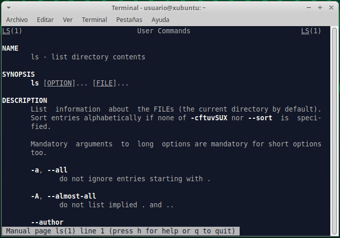

# Índice <a name="indice"></a>

1. [Abrir el terminal](#terminal)
2. [¿Cómo obtener ayuda sobre un comando?](#ayuda)  
3. [Comandos _bash_](#comandos)  
	3.1. [Listar de archivos y directorios](#archivos)  
	3.2. [Alias e historial](#alias)  
	3.3. [Manejo de directorios y archivos](#directorios)
	<!--
	3.4. [Manipulación de archivos](#ficheros)
			Texto plano vs binarios
			echo y stdout, sterr, stdin

			less, cat (zcat), head, tail, wc, grep 

			# No da tiempo cut, sed, sort, uniq, awk
			Compresión/descompresión

	3.5. Pipes y _bash scripting_ básico
	3.6. Conexión a un servidor (ifconfig y ssh)
	-->

[Resumen Comandos](#resumen)

***

# 1. Abrir el terminal <a name="terminal"></a> 

Abrimos la caja de aplicaciones (botón en el parte superior izquierda) y pinchamos en "Emulador de Terminal":  
<p align="center" width="100%">
	
</p>

<p align="center">Terminal</p>
<p align="center" width="100%">
	
</p>

# 2. ¿Cómo obtener ayuda sobre un comando?  <a name="ayuda"></a>  

> Ir al [Índice](#indice)

Para obtener ayuda sobre el uso de cualquier comando de _bash_ (_shell_ más habitual en GNU/Linux) podemos recurrir al [manual oficial de _bash_](https://www.gnu.org/software/bash/manual/bash.html), pero también podemos obtener ayuda directamente en el terminal usando el siguiente comando:  

```bash
# Quiero saber qué opciones tiene el comando "ls"
man ls
```

<p align="center" width="100%">
	
</p>


También podemos probar lo siguiente:
```bash
ls --help
```

> [!NOTE]  
> Algunos comandos en lugar de _--help_ usan sólo _-h_.  

Si usamos el segundo comando nos muestra en el terminal (salida estándar o _stdout_) todo el texto de la ayuda completo y tendremos que ir subiendo para buscar la información que buscamos. Sin embargo, con _mam ls_ la ayuda se muestra poco a poco de modo que pulsado las flechas del teclado (o también la barra espaciadora) podremos ir avanzando en el texto de la ayuda. Para salir debemos pulsar "q" o _ctrl+c_ (cancelar un proceso). 

Otra opción sería usar el comando _whatis_ que nos devuelve una muy breve reseña de en qué consiste el comando:

```bash
whatis ls
# Salida: ls (1) - list directory contents
```

Una herramienta muy útil online es [explainshell.com](https://explainshell.com/) donde podemos poner el comando completo que no entendemos (con sus parámetros/opciones) y nos explicada cada parte de éste de una manera bastante visual:  

<p align="center" width="100%">
	
</p>

Finalmente, todo buen "Bioinformático" copia y pega el comando (o el mensaje de error de algún comando) en _google_ para encontrar la solución navegando por las distintas páginas. Pero más recientemente, las herramientas de inteligencia artificial (ChatGPT, Gemini, Copilot, etc.) nos permiten obtener la misma ayuda sin necesidad de navegar por varias páginas hasta encontrar la solución (pero hay que tener unos conocimientos mínimos para entender si lo que nos está diciendo es correcto o no).  

<p align="center" width="100%">
	
</p>

# 3. Comandos _bash_ <a name="comandos"><a/>  

[Índice](#indice)

La mayoría de las distribuciones de GNU/Linux utilizan _bash_ como _shell_ pero existen muchas otras como _tsch_, _zsh_, _sh_, _ksh_, etc. En Mac, desde que utilizan sus propios procesadores (M1, M2, etc.) utilizan por defecto _zsh_, que se puede cambiar por _bash_, aunque la mayoría de los comandos son iguales en todas las _shell_. 


## 3.1. Listar de archivos y carpetas <a name="archivos"><a/>  

> Ir al [Índice](#indice)

### _ls_ (_list_)

Este comando permite ver/listar los archivos/ficheros y las carpetas/directorios que hay en la ubicación actual:  

```bash
ls
```
<p align="center" width="100%">
	
</p>

En la mayoría de las _shells_ actualmente los archivos y directorias se colorean de manera diferente (también los enlaces simbólicos o accessos directos, ver más abajo para saber que son).  

Pero si no es así y queremos ver los archivos y carpetas coloreados diferencialmente debemos usar la siguiente opción:  

```bash
ls --color=auto

# En Mac sería: ls -G
```

Si queremos obtener más información de los archivos y directorios podemos utilizar la opción _-l_ que además nos proporciona un formato tipo tabla más fácil de visualizar:  

```bash
ls -l
```
<p align="center" width="100%">
	
</p>


El espacio que ocupan los archivos por defecto se nos indica en bytes, pero si queremos que se indique de una manera más comprensible podemos añadir la opción _-h_:

```bash
ls -l -h 

# También podemos juntar las opciones

ls -lh
```
<p align="center" width="100%">
	
</p>

Si queremos ordenar los archivos por su fecha de modificación (más reciente a más antiguo) podemos utilizar la opción _-t_:

```bash
ls -lht
```

<p align="center" width="100%">
	
</p>

Si queremos que el orden sea el inverso (más antiguo a más reciente) añadimos la opción _-r_:

```bash
ls -lhtr
```

<p align="center" width="100%">
	
</p>

Lo que nos muestra el comando _ls_ con las opciones que hemos visto hasta ahora son solo los archivos y directorios visibles, sin embargo, hay muchos otros archivos o directorios ocultos, cuyo nombre empieza por "." que generalmente no vemos, y que conviene no tocar si no tenemos mucha experiencia con GNU/Linux. Para ver los archivos y directorios ocultos usaremos la opción _-a_:

```bash
ls -lha
```

<p align="center" width="100%">
	
</p>

<a name="dir_especiales"><a/>
Aquí quiero que veamos dos directorios especiales que existen dentro de todos los directorios:

- Directorio ".": hace referencia al propio directorio en el que nos encontramos.  
- Directorio "..": hace referencia al directorio superior (_parent_) que nos permitirá cambiar a este.  

La utilidad de estos dos directorios especiales los veremos en el siguiente apartado.  

Otro archivo oculto interesante es _.profile_ o _.bashrc_ donde, cuando tiene más experiencia, puedes incluir instrucciones que se ejecutarán al arrastar el terminal.  

> Si queremos crear un fichero oculto por la razón que sea, simplemente tenemos que cambiarle el nombre para que empiece por ".".  

## 3.2 Alias e historial <a name="alias"><a/>  

En el caso del comando _ls_, que es un comando muy utilizado, si queremos usar varias de las opciones que hemos visto, puede ser un poco tedioso escribirlo todas las veces (_ls -lh --color=auto_). Afortunadamente, en casi todos los sistemas basado en Linux tenemos la opción de pulsar la flecha hacia arriba para ver los comandos que hemos escrito anteriormente (con posibilidad de editarlos si había algún error). Esto es lo que se conoce como historial, que también podemos verlo escribiendo _history_. 

```bash
history
```

<p align="center" width="100%">
	
</p>

Podemos copiar comandos del historial para volver a usarlos. 

> [!IMPORTANT]
> Para copiar y pegar en el terminal no se usa _**ctrl+c**_ y _**ctrl+v**_ (principalmente porque _**ctrl+c**_ está reservado para cancelar algún comando en ejecución). Podemos usar el botón derecho del ratón y darle a copiar/pegar en el menú que aparece o podemos usar _**ctrl+shift+c**_ para copiar y _**ctrl+shift+v**_ para pegar (si lo que copiamos y pegamos tienes varias líneas aparecerá una ventana que nos preguntará si estamos seguros).  

Además del historial, podemos crear un _alias_ (es como una especie de acceso directo o atajo). Tendremos que decidir un nombre para nuestro comando abreviado (por ejemplo, yo voy a usar la letra "l":

```bash
alias l='ls -lh --color=auto'
```

> [!IMPORTANT]
> Hay que tener cuidado al elegir el nombre de los alias para evitar usar algún termino que ya exista para otro comando.  

De este modo cada vez que yo ejecute _l_ en realidad estaré ejecutando _ls -lh --color=auto_. Sin embargo, cuando cerremos el terminal y lo volvamos a abrir el alias habrá desaparecido. Para hacerlo permanente habrá que meter esta instrucción en el fichero _.bashrc_ (en otras _shells_ este fichero puede llamarse de manera diferente: _.tcshrc_, _.zhrc_, etc.). Estos ficheros se denominan _ficheros de iniciación_ y contienen instrucciones esenciales para el funcinamiento de la _shell_ como la localización de los comandos, librerías y binarios que estamos ejecutando. Estos ficheros son leidos cuando iniciamos una sesión en el terminal.  

Para añadir una insctrucción en _.bashrc_ vamos a utilizar un editor de texto que viene integrado en el terminal: _nano_.  

```bash
nano .bashrc
```
<p align="center" width="100%">
	
</p>

Este fichero contiene muchas instrucciones que no vamos a tocar. Simplemente iremos al final del fichero, usando las fechas del teclado, y añadiremos al final el alias que queremos usar:  

<p align="center" width="100%">
	
</p>

Para salir/guardar los cambios pulsamos _**ctrl+x**_, nos preguntará si queremos guardar los cambios, pulsaremos "y" y luego nos pedirá confirmar el nombre del fichero pulsando "enter".  

Entonces habremos salido del editor, pero aún no se habrán actualizado los cambios que hemos introducido en el fichero. Para actualizarlo podemos hacer un _source .bashrc_, que básicamente lee el fichero y ejecuta los comando que hay en él o bien cerramos el terminal y lo volvemos a abrir, ya que estos ficheros se leen/ejecutan al arrascar el terminal. Ahora ya tenemos el alias disponible y no tendremos que volver a escribir todo el comando de nuevo. Obviamente podemos tener todos los alias que queramos, por ejemplo, otro alias interesante sería _alias ll='ls -lhtra --color=auto'_ que nos permite ver todos los ficheros, incluidos los ocultos ordenados por fecha de manera inversa. Esto es útil para ver los ficheros/directorios nuevos que se hayan creado como parte de un programa/comando que estemos ejecutando.  

## 3.3. Manejo de directorios y archivos <a name="directorios"><a/>  

> Ir al [Índice](#indice)

Antes de empezar a aprender los comandos necesarios para movernos y manejar directorios es necesario que conozcamos la estructura de directorios de Linux. 

Los sistemas GNU/Linux tienen un patrón bastante estricto y específico al respecto de la organización jerárquica de los directorios, definido por _Filesystem Hierarquy Standard_ (_FHS_), para evitar problemas de compatibilidad entre distribuciones y conseguir un sistema operativo sólido.  

La base de esta jerarquía es el directorio raíz (_root_), que se representa con el signo «/», y contiene al resto de directorios/archivos. 

Dentro del directorio raíz («/») encontramos varios directorios que posee funciones específicas para el sistema operativo. Los principales se describen en la siguiente tabla:


| Directorio  | Descripción                                                                                                                         |
|-------------|-------------------------------------------------------------------------------------------------------------------------------------|
| /bin        | aplicaciones binarias importantes                                                                                                   |
| /boot       | Ficheros de configuración del arranque, núcleos y otros ficheros necesarios para el arranque (boot) del equipo.                     |
| /dev        | los ficheros de dispositivo                                                                                                         |
| /etc        | ficheros de configuración, scripts de arranque, etc.                                                                                |
| /home       | directorios personales (home) para los diferentes usuarios.                                                                         |
| /lib        | librerías del sistema (libraries)                                                                                                   |
| /media      | particiones montadas (cargadas) automáticamente en el disco duro y medios (media) extraíbles como CDs, cámaras digitales, etc.      |
| /mnt        | sistemas de archivos montados manualmente en el disco duro.                                                                         |
| /opt        | proporciona una ubicación donde instalar aplicaciones opcionales (de terceros)                                                      |
| /proc       | directorio dinámico especial que mantiene información sobre el estado del sistema, incluyendo los procesos actualmente en ejecución |
| /root       | directorio personal del usuario root (superusuario); también llamado "barra-root".                                                  |
| /sbin       | binarios importantes del sistema                                                                                                    |
| /sys        | archivos del sistema (system)                                                                                                       |
| /tmp        | temporary files                                                                                                                     |
| /usr        | aplicaciones y archivos a los que puede acceder la mayoría de los usuarios                                                          |
| /var        | archivos variables como archivos de registros y bases de datos                                                                      |  

Para más detalles ver: [Linux Fundation](https://www.linuxfoundation.org/blog/blog/classic-sysadmin-the-linux-filesystem-explained), [Ayuda Linux](https://ayudalinux.com/estructura-sistema-archivos/) y [Ayuda Ubuntu](https://help.ubuntu.com/kubuntu/desktopguide/es/directories-file-systems.html).  

En este punto no es muy importante conocer los detalles de cada uno de estos directorios, ya que para hacer modificaciones en estos se requieren conocimientos más avanzados. 

El único directorio en el que nosotros vamos a trabajar en _home_, que contiene los archivos/directorios de cada uno de los usuarios (un mismo equipo con Linux puede tener más de un usuario definido, igual que en otros sistemas operativos). Cuando arrancamos el terminal o el visor de archivos generalmente nos llevará a la carpeta de nuestro usuario dentro de la carpeta _home_, por ejemplo, _/home/usuario/_. Para saber el directorio en el que nos encontramos podemos utilizar el comando _pwd_:

```bash
pwd

# Salida: /home/usuario
```

### Moverse entre directorios

Para cambiar de directorio utilizaremos el comando _cd_ (_change directory_). Por ejemplo, si queremos acceder a la carpeta _Descargas_ dentro de nuestra carpeta de usuario podemos escribir:

```bash
cd Descargas
```

Tras ello podemos comprobar con _pwd_ que ahora estamos en la carpeta _/home/usuario/Descargas/_.  

¿Qué ocurre si en lugar de _Descargas_ nos equivocamos y escribimos el nombre mal por error?  

```bash
cd descargas

# Salida: bash: cd: descargas: No existe el archivo o el directorio
```
> [!IMPORTANT]
> Efectivamente, Linux distingue entre mayúsculas y minúsculas, y por lo tanto, la carpeta _descargas_ no existe, y así nos lo indica el comando cuando lo ejecutamos.  

Para evitar este tipo de errores al escribir podemos hacer uso del tabulador (tecla TAB). Simplemente escribiendo las primeras letras del nombre de un archivo o directorio el terminal completará el nombre si sólo hay una opción, si hubiera más, pulsando TAB dos veces, te mostrará los nombre disponibles en el directorio actual. En el segundo caso podemos añadir alguna letra más del nombre y pulsar TAB para que se complete el nombre. Esto se conoce como _autocompletado_, y es muy útil para evitar errores.  

Bien, ahora que estamos en _/home/usuario/Descargas/_, ¿cómo vuelvo hacia atrás, a la carpeta anterior?  
Para ello usaremos uno de los 2 directorios especiales que hay dentro de cada directorio que vimos antes (ver [aquí](#dir_especiales)). En este caso usaremos el directorio ".." que hace referencia al directorio superior (_parent_), el que esta justo encima en la jerarquía:

```bash
cd ..
```

Ahora, si usamos _pwd_, podremos comprobar que hemos vuelto a _/home/usuario/_, y por lo tanto, hemos salido de la carpeta _Descargas_. 

Si queremos movernes varios niveles al mismo tiempo podemos encaderar la ruta a la que queremos entrar, Por ejemplo:

```bash
cd snap/firefox/common/
```

Y para ir hacia atrás varios directorios basta con encaderar ".." así:

```bash
cd ../../..
```

De este modo hemos ido 3 directorios hacia abajo en el jerarquía, hasta llegar a _/home/usuario/snap/firefox/common/_ y luego hemos subido 3 directorio para volver a _/home/usuario/_. 

Si ejecutamos el comando _cd_ sin ningún argumento (en este caso una ruta de un directorio) nos llegará a la carpeta _/home/usuario/_, que generalmente se refiero como _home_. También es posible hacer lo mismo con el caracter especial «~» (virgulilla, alt+4):

```bash
cd ~

# o podríamos usar este comodín en una ruta de directorios si no estamos en home

cd ~/snap/firefox/common/

# Esto es lo mismo que 
cd /home/usuario/snap/firefox/common/

# ~ = /home/usuario/

```

La otra carpeta especial que vimos anteriormente (".") hace referencia al directorio en el que estamos, es como decirle a la _shell_ que estamos aquí. Por lo tanto, podemos especificar un poco más al cambiar de directorio, borrar un directorio o un fichero, etc., añadiendo este punto en las instrucciones:

```bash
# Ejemplos- 
cd ./bia
rm -r ./bia
rm ./mi_fichero.txt
```
Esto no parece muy útil ahora mismo (a la par que inecesario), pero lo será necesario más adelante.

Por otro lado, si en lugar de movernos con _cd_, lo único que queremos es ver que hay en una carpeta podemos usar el comando _ls_ con la ruta que queremos explorar:

```bash
ls -lh snap/firefox/
# o
ls -lh ./snap/firefox/
# o
ls -lh ~/snap/firefox/
# o
ls -lh /home/usuario/snap/firefox/

# Todas son equivalentes
```
De esta manera veremos el contenido de la carpeta sin movernos de donde estamos.  

### Crear y borrar archivos y carpetas

Ahora vamos a crear un directorio con el comando _mkdir_ (_make directory_):

```bash
# vamos a home
cd
#
mkdir bia
```

Para eliminarlo usaremos el comando _rmdir_ (_remove directory_):
```bash
rmdir bia
```

> [!NOTE]
> _rmdir_ sólo sirve para eliminar directorios que estén vacíos.  

Vamos ahora a crear el directorio de nuevo, nos meteremos en este, y vamos a crear un fichero en su interior con el comando _touch_ (crea un fichero vacío con el nombre especificado) y un subdirectorio:

```bash
mkdir bia
cd bia
touch mi_fichero.txt
mkdir sub_bia
cd ..
```
> [!NOTE]
> Es recomendable no usar espacios, tildes o caracteres especiales (¿?!$.., salvo "-" o "\_") en los nombres de archivos o directorios en Linux. 

Si ahora intentamos borrar el directorio con _rmdir_ nos a dará el siguiente error:

`rmdir: fallo al borrar 'bia': El directorio no está vacío`

Podemos entrar en el directorio _bia_ y borrar el archivo _mi_fichero.txt_ con el comando _rm_ (_remove_) y el subdirectorio _sub_bia_ con _rmdir_ (que está vacío)...

```bash
cd bia
rm mi_fichero.txt
rmdir sub_bia
cd ..
```

O, podemos hacer uso de la _-r_ del comando _rm_ que elimina el contenido de un directorio de manera recursiva, es decir, entra en el directorio y todos los subdirectorio y elimina todas los archivos y directorios que encuentre.  

```bash
rm -r bia
```

> [!WARNING]
> Lo que se borra en el terminal (a través de la _shell_) se elimina definitivamente, no va a ninguna papelera de reciclaje de la que podemos recuperar lo archivos o directorios. Por lo tanto, hay que estar muy seguro cuando se borra algo. Para evitar errores podemos usar la opción _-i_ de _rm_ para que nos pregunte antes de borrar si estamos seguros (_rm -i mi_fichero.txt_). Podríamos incluir un alias en _.bashrc_ como ya hicimos antes para que siempre nos pregunta y evitar problemas (_alias rm='rm -i'_).  


### Mover/renombrar y copiar archivos y directorios

Antes de empezar necesitamos crear algunos archivos y directorios:

```bash
cd
mkdir bia
cd bia
mkdir sub_bia
mkdir sub_bia_2
touch mi_fichero.txt
touch ./sub_bia_2/mi_fichero_2.txt
cd ~/bia
```

Podemos usar el comando _tree_ para ver la estructura del directorio que hemos creado:
```bash
tree .

# Salida:
# .
#├── mi_fichero.txt
#├── sub_bia
#└── sub_bia_2
#    └── mi_fichero_2.txt
```

Ahora vamos a hacer algunos movimientos. 

Vamos a mover _mi_fichero.txt_ a la carpeta _sub_bia_. Para ello usaremos el comando _mv_ (_move_):
```bash
mv mi_fichero.txt sub_bia

# mv ./mi_fichero.txt ./sub_bia
# También podemos añadir una barra (slash) al final de sub_bia para especificar que es un directorio
# mv ./mi_fichero.txt ./sub_bia/

tree .
# .
# ├── sub_bia
# │   └── mi_fichero.txt
# └── sub_bia_2
#     └── mi_fichero_2.txt
```

Para mover directorios se hace exáctamente igual. Vamos a mover _sub_bia_ dentro de _sub_bia_2_:

```bash
mv sub_bia sub_bia_2
# mv ./sub_bia ./sub_bia_2
# mv ./sub_bia/ ./sub_bia_2/
tree .
# .
# └── sub_bia_2
#     ├── mi_fichero_2.txt
#     └── sub_bia
#         └── mi_fichero.txt
```

Básicamente el comando _mv_ toma 2 argumentos (o más, ver más abajo); lo que queremos mover y dónde queremos moverlo.  

¿Cómo muevo la carpeta _sub_bia_ fuera de _sub_bia_2_ donde estaba antes? Hay varias opciones:

```bash
# Escribiendo las rutas completas (o rutas absolutas)
mv /home/usuario/bia/sub_bia_2/sub_bia/ /home/usuario/bia/

# Usando la carpeta especial "." (desde /home/usuario/bia/, es decir, le decimos que mueva la carpeta a "aquí")
mv sub_bia_2/sub_bia .
# mv ./sub_bia_2/sub_bia .
# mv ./sub_bia_2/sub_bia/ .

# Usando la carpeta especial ".." (desde /home/usuario/bia/sub_bia_2/, es decir, le decimos que mueva la carpeta a la carpeta superior o parent)
cd sub_bia_2
mv sub_bia ..
# mv ./sub_bia ..
# mv ./sub_bia/ ..
```
Con ficheros, en lugar de directorios el comando _mv_ funciona exáctamente igual. También podemos mover más de una cosa a la vez. Para ello, le vamos a indicar varias cosas que queremos mover y por último el destino. Es decir, en este caso, el comando tomará más argumentos, siendo el último el destino. Vamos a mover los ficheros _mi_fichero.txt_ (dentro de _sub_bia_) y _mi_fichero_2.txt_ (dentro de _sub_bia_2_) a la carpeta superior (_bia_):

```bash
cd /home/usuario/bia
mv sub_bia/mi_fichero.txt sub_bia_2/mi_fichero_2.txt .
# mv /home/usuario/bia/sub_bia/mi_fichero.txt /home/usuario/bia/sub_bia_2/mi_fichero_2.txt /home/usuario/bia
tree .
#.
#├── mi_fichero_2.txt
#├── mi_fichero.txt
#├── sub_bia
#└── sub_bia_2
```

¿Cómo cambiamos el nombre a un archivo/directorio? 

Usando el comando _mv_, pero en lugar de ponerle un destino distinto al actual le indicamos el nuevo nombre que queremos darle. Obviamente este nuevo nombre debe ser único, que no exista un archivo o directorio con ese nombre, porque en el caso de existir lo que estamos haciendo en mover el archivo/directorio o en el peor de los casos estaremos sobre-escribiendo un archivo que ya existe. Vamos a renombrar _mi_fichero.txt_ a _mi_archivo.txt_:

```bash
mv mi_fichero.txt mi_archivo.txt
tree .
#.
#├── mi_fichero_2.txt
#├── mi_archivo.txt
#├── sub_bia
#└── sub_bia_2
```

Ahora vamos a renombrar el directorio _sub_bia_:

```bash
mv sub_bia sub_bia_1
tree .
#.
#├── mi_fichero_2.txt
#├── mi_archivo.txt
#├── sub_bia_1
#└── sub_bia_2
```

Las operaciones de renombrado y movimiento se pueden combinar, es decir, podemos mover y renombrar un fichero/directorio a la vez:

```bash
mv mi_fichero_2.txt ./sub_bia_2/mi_archivo_2.txt

tree .
#.
#├── mi_archivo.txt
#├── sub_bia_1
#└── sub_bia_2
#    └── mi_archivo_2.txt
```

Tomamos _mi_fichero_2.txt_ y le damos un nuevo destino en _sub_bia_2_ con un nuevo nombre _mi_archivo_2.txt_.  

Para copiar archivos o carpetas usaremos el comando _cp_ (_copy_) de manera muy similar a cómo hemos usado el comando _mv_. En general a _cp_ debemos pasarle 2 argumentos, aquello que queremos copias (archivos or directorios) y dónde queremos copiarlos.  

Por ejemplo, vamos a copiar el fichero _mi_archivo.txt_ al interior de la carpeta _sub_bia_1_:

```bash
cp mi_archivo.txt sub_bia_1

tree .
#.
#├── mi_archivo.txt
#├── sub_bia_1
#    └── mi_archivo.txt
#└── sub_bia_2
#    └── mi_archivo_2.txt
```

¿Cómo hago una copia del fichero _mi_archivo.txt_ en el mismo directorio? Obviamente no podrá llamarse igual, porque entonces no estaremos haciendo una copia. Entonces, en lugar de darle un destino como segundo argumento, tendremos que darle un nuevo nombre (que no ha de existir en el directorio):

```bash
cp mi_archivo.txt mi_archivo_3.txt

tree .
#.
#├── mi_archivo_3.txt
#├── mi_archivo.txt
#├── sub_bia_1
#    └── mi_archivo.txt
#└── sub_bia_2
#    └── mi_archivo_2.txt
```

¿Cómo copiamos directorios? Usamos la misma estrategia, pero debemos añadir al comando _cp_ la opción _-r_ (_recursive_), que copiará el directorio y todo su contenido:

```bash
cp -r sub_bia_1 sub_bia_2

tree .
#.
#├── mi_archivo_3.txt
#├── mi_archivo.txt
#├── sub_bia_1
#│    └── mi_archivo.txt
#└── sub_bia_2
#    ├── mi_archivo_2.txt
#    └── sub_bia_1
#        └── mi_archivo.txt
```

Con el comando _cp_ podemos copiar y renombrar al mismo tiempo, parecido a como hicimos con _mv_, además del destino en el que queremos copiar el archivo/directorio, debemos incluir el nuevo nombre:

```bash
cp -r sub_bia_1 sub_bia_2/sub_bia_3

tree .
#.
#├── mi_archivo_3.txt
#├── mi_archivo.txt
#├── sub_bia_1
#│    └── mi_archivo.txt
#└── sub_bia_2
#    ├── mi_archivo_2.txt
#    └── sub_bia_1
#        └── mi_archivo.txt
#    └── sub_bia_3
#        └── mi_archivo.txt
```

Como en _mv_ podemos procesar, en el caso de _cp_ copiar, varios archivos/directorios al mismo tiempo, incluyendo siempre el destino como último argumento del comando:


```bash
cp mi_archivo.txt mi_archivo_3.txt sub_bia_2

tree .
#.
#├── mi_archivo_3.txt
#├── mi_archivo.txt
#├── sub_bia_1
#│    └── mi_archivo.txt
#└── sub_bia_2
#    ├── mi_archivo_2.txt
#    ├── mi_archivo_3.txt
#    ├── mi_archivo.txt
#    └── sub_bia_1
#        └── mi_archivo.txt
#    └── sub_bia_3
#        └── mi_archivo.txt
```

### Wildcards

Si quisieramos mover o copiar muchos archivos/directorios ponerlos todos como argumentos puede ser bastante tedioso. Imaginad que queremos mover 20 archivos, tendríamos que poner 20 argumentos en el comando y luego el destino. Para hacer esto más sencillo tenemos lo que se conoce como _wildcards_, que podríamos traducir como comodines. Vamos a ver los 2 más importantes: «\*» y «?» (para más info ver [aquí](https://rsg-ecuador.github.io/unix.bioinfo.rsgecuador/content/Curso_basico/03_Manejo_terminal/5_wildcards.html)). 

El comodín «?» sirve para sustituir un único caracter por cualquier cosa. Por ejemplo, si quieramos mover los archivos _mi_archivo_2.txt_ y _mi_archivo_3.txt_ dentro de la carpeta _sub_bia_2_ lo podríamos hacer así:

```bash
cd sub_bia_2
mv mi_archivo_?.txt sub_bia_1
cd ..

tree .
#.
#├── mi_archivo_3.txt
#├── mi_archivo.txt
#├── sub_bia_1
#│    └── mi_archivo.txt
#└── sub_bia_2
#    ├── mi_archivo.txt
#    ├── sub_bia_1
#    │    ├── mi_archivo_2.txt
#    │    ├── mi_archivo_3.txt
#    │    └── mi_archivo.txt
#    └── sub_bia_3
#        └── mi_archivo.txt
```

En este ejemplo, los nombres sólo se diferencia en un caracter, podemos añadir tanto «?» como sean necesario (ex: _mi_archivo??.txt_ permitiría copiar todos los fichero tipo _mi_archivo_01.txt_, _mi_archivo_02.txt_, _mi_archivo_xx.txt_, etc., siempre son 2 caracteres en la zona de los 2 comodines).  


El segundo comodín, «\*», permite sustituir cualquier caracter y cualquier número de caracteres, lo que lo hace más potente que el primero. Vamos a crear una nueva carpeta y vamos a copiar todos los archivos acabados en _.txt_ de la carpeta _sub_bia_2/sub_bia_1_:

```bash
mkdir sub_bia_4
cp ./sub_bia_2/sub_bia_1/*.txt sub_bia_4

tree .

#.
#├── mi_archivo_3.txt
#├── mi_archivo.txt
#├── sub_bia_1
#│    └── mi_archivo.txt
#├── sub_bia_2
#│    ├── mi_archivo.txt
#│    ├── sub_bia_1
#│    │    ├── mi_archivo_2.txt
#│    │    ├── mi_archivo_3.txt
#│    │    └── mi_archivo.txt
#│    └── sub_bia_3
#│        └── mi_archivo.txt
#└── sub_bia_4
#    ├── mi_archivo_2.txt
#    ├── mi_archivo_3.txt
#    └── mi_archivo.txt
```

También podemos usar los comodines (_wildcards_) para eliminar varios archivos/directorios al mismo tiempo:

```bash
rm ./sub_bia_4/*.txt

tree .

#.
#├── mi_archivo_3.txt
#├── mi_archivo.txt
#├── sub_bia_1
#│    └── mi_archivo.txt
#├── sub_bia_2
#│    ├── mi_archivo.txt
#│    ├── sub_bia_1
#│    │    ├── mi_archivo_2.txt
#│    │    ├── mi_archivo_3.txt
#│    │    └── mi_archivo.txt
#│    └── sub_bia_3
#│        └── mi_archivo.txt
#└── sub_bia_4
```

### Enlaces simbólicos (_symbolic links_)

Si trabajamos con archivos de secuenciación masiva, a veces, lo archivos son muy grandes (≥1Gb), y dado que contienen los datos fundamentales de nuestro experimento, es mejor no manipularlos directamente, ni trabajar en el directorio en el que los tenemos, para evitar borrados accidentales. Obviamente podríamos crear una copia de los archivos, pero eso podría suponer problemas de almacenamiento en el disco duro, que podría llenarse e impedir realizar cualquier análisis for falta de espacio. Para solucionar esto (y otros problemas similares en otras áreas) existe lo que se conoce como **Enlaces simbólicos**. Son similares a los _accesos directos_ en otros sistemas operativos como Windows. Básicamente crearemos un enlace, no una copia, del archivo en otro lugar para poder trabajar con lo archivos. Si accidentalmente barrásemos este enlace simbólico, no pasaría nada, porque el archivo original estaría protegido en otro lugar. Para crear los enlaces simbólicos usaremos el comando _ls_. Vamos crear algunos directorios y archivos para el ejemplo:

```bash
cd
mkdir datos
cd datos
touch secuencias_super_importantes.fastq
cd ..
```

Ahora tenemos nuestros datos, que hemos obtenido con esfuerzo y probablemente con un coste elevado, y no queremos perderlos. Para trabajar con los datos haremos un enlace simbólico al archivo en otro directorio separado:

```bash
cd
mkdir analisis_datos
cd analisis_datos
ln -s /home/usuario/datos/secuencias_super_importantes.fastq .
```
<p align="center" width="100%">
	
</p>

Como vemos los enlaces simbólicos se representa con un color diferente (_ls -lh --color=auto_) y nos indica dónde está el fichero original.

Como vemos en el comando, hemos usado la opción _-s_ que significa _soft_, que es el tipo más habitual y para este curso no vamos a necesitar de otros tipos. Si queréis conocer más sobre los enlaces simbólicos podéis leerlo [aquí](https://rm-rf.es/diferencias-entre-soft-symbolic-y-hard-links/). 

También podemos ver que hemos puesto la ruta absoluta (desde la raiz «/»), que es lo más recomendable, aunque en Linux se podrían usar rutas relativas (usando «..») y añadiendo la opción _-r_. Además, podemos nombrar nuestro enlace de una manera diferente al archivo original, dándole un nuevo nombre en el destino:

```bash
ln -sr ../datos/secuencias_super_importantes.fastq ./secuencias.fastq

tree .
#.
#├── secuencias.fastq -> ../datos/secuencias_super_importantes.fastq
#└── secuencias_super_importantes.fastq -> /home/usuario/datos/secuencias_super_importantes.fastq
```

> [!WARNING]
> En Mac, que es Linux, no existe la opción _«-r»_ por lo que hay que utilizar siempre rutas absolutas.  


