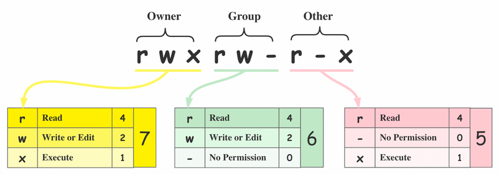

## 3.4. Manipulación de archivos <a name="ficheros"><a/>  

> Ir al [Índice](#indice)

Lo primero que debemos saber es que hay 2 grandes tipos de archivos que nos conciernen en este punto: 

- **Texto plano**: el contenido del archivo es directemente legible por un humano. Un ejemplo de este tipo de archivos sería los de tipo _txt_, _csv_, _tsv_ y muchos otros que se usan en secuenciación masiva para almacenar las secuencias (_fasta_, _fastq_, _sam_, _vcf_, etc.), que los veremos más adelante.  
- **Binarios**: el contenido del archivo sólo es entendible por un humano si se usa un programa especial para abrirlo. Un ejemplo sería un archivo de Microsotf Word (_docx_), cuyo contenido sólo es legible si usamos un editor de texto, ya sea el propio Microsoft Word u otro compatible (ex_ LibreOffice). También son parcialmente binarios los archivos _pdf_, _png_, _jpeg_, etc. Si trataramos de ver el contenido de estos ficheros con un editor de texto plano sólo veríamos una sucesión de caracteres ininteligibles para nosotros/as, pero perfectamente entendibles por un ordenador.  

Otra cosa importante que mencionar es que las extensiones de los archivos (_.txt_, _.pdf_) sólo sirven para que el sistem operativo sepa con qué programa específico debe abrirlos.  

La mayoría de los archivos que vamos a manejar serán de tipo _texto plano_ y a veces estarán comprimidos para ocupar menos espacio (lo que los convierte en binarios).  

Ya hemos visto antes cómo crear un archivo vacío con el comando _touch_, pero hay otra formas de crear archivos, principalmente redirigiendo la salida estándar (_stdout_) de algún comando.  

Cuando ejecutamos un comando en el terminal, si este genera algún tipo de salida, se muestra en la pantalla del terminal, siendo esta la salida estándar por defecto. Utilizando el operados «>» podemos redirigir lo que se muestra por pantalla a un archivo. Para este ejemplo usaremos el comando _echo_ que muestra por pantalla el texto que le demos (también puede mostrar el contenido de una variable):

```bash
cd
cd bia
echo "Esto es una prueba" > nuevo_archivo.txt
```

Ahora podemos comprobar con _ls_ o _tree_ que hemos creado un nuevo archivo. En este caso, a diferencia de los anteriores en los que usamos el comando _touch_ para crearlos, el nuevo archivo no está vacío, lo que podemos comprobar por el espacio que ocupa:

<p align="center" width="100%">
	
</p>

Si quisiéramos añadir algún texto a nuestro archivo de manera rápida podríamos usar también el comando _echo_, pero ahora, en lugar de usar al operador «>», que crearía un nuevo archivo sobre-escribiendo el que ya existe si usamos el mismo nombre, usaremos el operador «>>» que añade el nuevo contenido al archivo existente (si usamos este operador con el nombre de un fichero que no existe, se crear también y se añade el contenido):

```bash
echo "Voy a añadir nueva información" >> nueva_archivo.txt
```

Otra forma de crear, o editar, un archivo desde el terminal es usando diversos editores de texto plano que vienen ya pre-instalador en la _shell_. Los más habituales son _vim_, más antiguo y difícil de manejar pues debes conocer los atajos de teclado para operar, y _nano_ que es más intuitivo. Vamos a ver y editar nuestro archivo con _nano_:

```bash
nano nuevo_archivo.txt

# Añadimos o modificamos lo que queremos
# Para guardar pulsamos ctrl+o
# Para salir pulsamos ctrl+x
```

<p align="center" width="100%">
	
</p>


Como vemos en la parte inferior del editor tenemos una chuleta con los comandos que podemos usar, como guardar, cerrar, cortar y pegar, etc. La tecla _ctrl_ está simbolizada como «^» para ahorrar espacio. 


En lugar de editar un archivo que ya existe podemos crear uno nuevo escribiendo el nombre de un nuevo archivos que no exista:

```bash
nano nuevo_archivo_2.txt
```

Sin embargo, generalmente los archivos que vamos a manejar no son tan simples, por lo que para aprender los comandos más habituales para ver el contenido y analizar el contenido de un fichero de texto plano vamos a utilizar el archivo «countries.csv» (modificado de [aquí](https://simplemaps.com/data/countries)) y que tenéis disponible en la carpeta _/home/usuario/Documentos/_. Para no borrar accidentalmente el archivo vamos a hacernos una copia en una nueva carpeta:

```bash
cd
mkdir countries
cp /home/usuario/Documentos/countries.tsv countries
cd countries
```

Vamos a echar un vistazo al contenido del archivo con el comando _less_, que no muestra el contenido en trozos del tamaño de la ventana del terminal, que podremos ir moviendo con las fechas o con la barra de espacio. 

```bash
less countries
```

Quizás cuesta un poco, pero se puede intuir que estamos ante una tabla, lo que ya se podía intuir por su extensión _tsv_ (_tab separated values_, valores separados por tabuladores). Existe otro tipo de tablas en formato texto plano que sería el _csv_ (_comma separated values_, valores separados por comas), siendo ambos formatos importables en Microsoft Excel (o LibreOffice).  

En la visualización en el terminal a veces las columnas están un poco desfasadas dependiendo el tamaño del texto de cada "celda", por lo que no siempre es fácil verlo. En cualquier caso, estamos ante una tabla de paises con varios datos de cada uno de ellos (moneda usado, población, etc.). En la siguiente tabla podemos ver algo mejor las primers líneas del archivo.  

| country       | currency             | population | density | area     | gdp      | language   | driving_side | continent     | un_member | religion     |
|---------------|----------------------|------------|---------|----------|----------|------------|--------------|---------------|-----------|--------------|
| China         | Chinese Yuan         | 1413142846 | 147.2   |  9596960 | 17963170 | Chinese    | right        | Asia          |    TRUE   | No Religion  |
| India         | Indian Rupee         | 1399179585 | 425.6   |  3287263 |  3465541 | Hindi      | left         | Asia          |    TRUE   | Hinduism     |
| United States | United States Dollar |  339665118 | 34.5    |  9833517 | 25744100 | English    | right        | North America |    TRUE   | Christianity |
| Indonesia     | Rupiah               |  279476346 | 146.7   |  1904569 |  1319100 | Indonesian | left         | Asia          |    TRUE   | Islam        |
| Pakistan      | Pakistani Rupee      |  247653551 | 311.1   |   796095 |   326796 | Urdu       | left         | Asia          |    TRUE   | Islam        |
| Nigeria       | Naira                |  230842743 | 249.9   |   923768 |    15414 | English    | right        | Africa        |    TRUE   | Christianity |
| Brazil        | Brazilian Real       |  218689757 |    25.7 |  8515770 |  1920095 | Portuguese | right        | South America |    TRUE   | Christianity |
| Bangladesh    | Bangladeshi Taka     |  167184465 |  1126.1 |   148460 |   432677 | Bengali    | left         | Asia          |    TRUE   | Islam        |
| Russia        | Russian Ruble        |  141698923 |     8.3 | 17098242 |  2240422 | Russian    | right        | Europe        |    TRUE   | Christianity |

Para salir de la visualización del archivo que estamos haciendo con _less_ debemos pulsar la tecla «q» (_quit_) o _ctrl+c_ (_cancel_). 


Si sólo queremos echar un vistazo al inicio del archivo podemos usara el comando _head_, que por defecto nos muestra las primeras 10 líneas, pero que podemos modificar usando la opción _-n_ para mostrar las primeras n líneas que necesitemos:

```bash
head -n 5 countries.tsv

# country	currency	population	density	area	gdp	language	driving_side	continent	un_member	religion
# China	Chinese Yuan	1413142846	147.2	9596960	17963170	Chinese	right	Asia	TRUE	No Religion
# India	Indian Rupee	1399179585	425.6	3287263	3465541	Hindi	left	Asia	TRUE	Hinduism
# United States	United States Dollar	339665118	34.5	9833517	25744100	English	right	North America	TRUE	Christianity
# Indonesia	Rupiah	279476346	146.7	1904569	1319100	Indonesian	left	Asia	TRUE	Islam
```

_tail_ funciona igual que _head_, pero nos mostrará las n últimas líneas (por defecto 10):

```bash
tail -n 5 countries.tsv

# South Georgia and the South Sandwich Islands	Pound Sterling					English	left	Seven seas (open ocean)	FALSE	
# Heard Island and McDonald Islands				412			left	Seven seas (open ocean)	FALSE	
# Bouvet Island				49			right	Antarctica	FALSE	
# Antarctica				14200000				Antarctica	FALSE	No Religion
#
```

Como vemos, sólo nos muestra 4 líneas con contenido porque hay una última línea en blanco al final del archivo.


Podríamos combinar estos comandos, y otros, usando lo que se conoce como _pipes_, o tuberías, que básicamente permiten pasar la salida de un comando al siguiente. Por ejemplo, imaginamos que queremos copiar la información de India, que está en la tercera línea del fichero. Obviamente podríamos abrirlo con _nano_ y copiar la tercera línea, pero no siempre vamos a poder hacer esto por el tamaño de lso archivos, que podrían llegar a no abrirse con _nano_ (o _vim_) o tardarían demasiado. Para hacerlo rápido podemos tomar las 3 primeras líneas con _head_ y luego pasar esas líneas a _tail_ y pedirle que nos devuelva sólo la última. Esto se ehecutaría así:

```bash
head -n 3 countries.tsv | tail -n 1

# India	Indian Rupee	1399179585	425.6	3287263	3465541	Hindi	left	Asia	TRUE	Hinduism
```

Hemos utilizado el operador «|» (_pipe_) para separar los comandos que se escribe pulsando alt+1. Veremos más adelante que podemos combinar muchos comandos usando _pipes_.  

Si quisiéramos guardar el resultado del comando anterior en un archivo se podrían añadir al final el operador «>» y darle el nombre que queramos al nuevo archivo:

```bash
head -n 3 countries.tsv | tail -n 1 > india.txt
```

En este caso no obtenemos ningún resultado por pantalla, ya que hemos redirigido la salida estándar (la pantalla del terminal) a un archivo («>») creando un nuevo archivo con la información. 

Supongamos ahora que queremos ver la información del medio de la tabla, por ejemplo Senegal. Podemos usar _less_ e ir buscando línea a línea hasta encontrar lo que buscamos o podemos usar un comando para hacerlo más rápido. En este caso vamos a utilizar el comando _grep_ que nos permite buscar texto (con o sin comodines, _wildcards_) en el contenido de un archivo. La sintaxis es sencilla, le decimos qué queremos buscar y dónde:

```bash
grep senegal countries.tsv
```

Nada, no nos devuelve nada. ¿Por qué? 

> [!IMPORTANT]
> Por que en Linux "senegal" no es lo mismo que "Senegal", es decir, Linux diferencia mayúsculas de minúsculas (en Windows y Mac esto no es así). 

Entonces podemos repetir la búsqueda con "Senegal" o bien, si no sabemos cómo está escrito en la tabla, podemos usar la opción «-i» de _grep_ que lo hace insensible a las mayúsculas/minúsculas:

```bash
grep -i senegal countries.tsv

# Senegal	West African Cfa Franc	18384660	93.5	196722	27775	French	right	Africa	TRUE	Islam
```

Ahora sí obtenemos el resultado deseado. 

Vale, pero y si no tenemos muy claro como se escribe el nombre de un país. Por ejemplo, en español Zimbabue se escribe así, pero y en inglés o en Shona (el idioma oficial de este país)... Probablemente no sea muy diferente, así que podemos hacer búsquedas con textos parciales, por ejemplo, solo "zi":

```bash
grep -i zi countries.tsv

#Brazil	Brazilian Real	218689757	25.7	8515770	1920095	Portuguese	right	South America	TRUE	Christianity
#Zimbabwe	Zimbabwean ZiG	15418674	39.5	390757	26418	English	left	Africa	TRUE	Christianity
```
Vemos que ha encontrado "zi" en 2 líneas de la tabla: Bra**zi**l y **Zi**mbabwe. 

Supongamos ahora que nos interesa saber qué paises se llaman "United lo que sea". Pero no tengo muy claro si "united" lleva una o 2 "t". Podríamos hacer la siguiente búsqueda:

```bash
grep -i unit* countries.tsv

```

Como vemos en la tabla de debajo con los resultados de la búsqueda anterior, tenemos algunos resultados de paises que su nombre no empieza por "united", si no que _grep_ ha encontrado el patrón _unit*_ en otras partes, mayoritariamente en la moneda usada por el país:

| United States                        | United States Dollar        | 339665118 | 34.5  | 9833517 | 25744100 | English    | right | North America           |  TRUE | Christianity |
|--------------------------------------|-----------------------------|----------:|-------|--------:|---------:|------------|-------|-------------------------|:-----:|--------------|
| United Kingdom                       | British Pound               |  68138484 | 279.7 |  243610 |  3089072 | English    | left  | Europe                  | FALSE | Christianity |
| Ecuador                              | United States Dollar        |  17483326 | 61.7  |  283561 |   115049 | Spanish    | right | South America           |  TRUE | Christianity |
| Tunisia                              | Tunisian Dinar              |  11976182 | 73.2  |  163610 |    46181 | Arabic     | right | Africa                  |  TRUE | Islam        |
| United Arab Emirates                 | United Arab Emirates Dirham |   9973449 | 119.3 |   83600 |   507063 | Arabic     | right | Asia                    |  TRUE | Islam        |
| El Salvador                          | United States Dollar        |   6602370 | 313.8 |   21041 |    32488 | Spanish    | right | North America           |  TRUE | Christianity |
| Panama                               | United States Dollar        |   4404108 | 58.4  |   75420 |    76522 | Spanish    | right | North America           |  TRUE | Christianity |
| Puerto Rico                          | United States Dollar        |   3057311 | 335.8 |    9104 |   113434 | Spanish    | right | North America           | FALSE | Christianity |
| Timor-Leste                          | United States Dollar        |   1476042 | 99.2  |   14874 |     3204 | Portuguese | left  | Asia                    |  TRUE | Christianity |
| Guam                                 | United States Dollar        |    169330 | 311.3 |     544 |          | English    | right | Oceania                 | FALSE | Christianity |
| United States Virgin Islands         | United States Dollar        |    104917 | 54.9  |    1910 |          | English    | left  | North America           | FALSE | Christianity |
| Federated States of Micronesia       | United States Dollar        |    100319 | 142.9 |     702 |      427 | English    | right | Oceania                 |  TRUE | Christianity |
| Marshall Islands                     | United States Dollar        |     80966 | 447.3 |     181 |      279 | English    | right | Oceania                 |  TRUE | Christianity |
| Turks and Caicos Islands             | United States Dollar        |     59367 | 62.6  |     948 |     1138 | English    | left  | North America           | FALSE | Christianity |
| Northern Mariana Islands             | United States Dollar        |     51295 | 110.5 |     464 |          | English    | right | Oceania                 | FALSE | Christianity |
| American Samoa                       | United States Dollar        |     44620 | 199.2 |     224 |      709 | English    | right | Oceania                 | FALSE | Christianity |
| British Virgin Islands               | United States Dollar        |     39369 | 260.7 |     151 |          | English    | left  | North America           | FALSE | Christianity |
| Caribbean Netherlands                | United States Dollar        |     30397 |       |         |      725 | English    | right | North America           | FALSE | Christianity |
| Palau                                | United States Dollar        |     21779 | 47.4  |     459 |      225 | English    | right | Oceania                 |  TRUE | Christianity |
| United States Minor Outlying Islands | United States Dollar        |       300 |   6.1 | 49.26   |          | English    | right | North America           | FALSE | Christianity |
| British Indian Ocean Territory       | United States Dollar        |           |       |      60 |          | English    | right | Seven seas (open ocean) | FALSE | Islam        |
| Réunion                              | Euro                        |           |       |         |          | French     | right | Africa                  | FALSE | Christianity |

Pero eso no es lo que queríamos. ¿Cómo le decimos a _grep_ que busque en el nombre de los paises? Pues sabemos que el nombre del país es lo primero que parece en la tabla, luego, le podemos decir a _grep_ que busque al patrón justo al principio usando el operador «^» al inicio del patrón:

```bash
grep -i ^unit* countries.tsv

# United States	United States Dollar	339665118	34.5	9833517	25744100	English	right	North America	TRUE	Christianity
# United Kingdom	British Pound	68138484	279.7	243610	3089072	English	left	Europe	FALSE	Christianity
# United Arab Emirates	United Arab Emirates Dirham	9973449	119.3	83600	507063	Arabic	right	Asia	TRUE	Islam
# United States Virgin Islands	United States Dollar	104917	54.9	1910		English	left	North America	FALSE	Christianity
# United States Minor Outlying Islands	United States Dollar	300	6.1	49.26		English	right	North America	FALSE	Christianity

```

También podemos usar el operador «$» para buscar patrones que estén justo al final de cada línea. Por ejemplo, cuántos paises tienen como religión el Islam:

```bash
grep -i islam$ countries.tsv
```

¿Cuántos hay? Muchos... ¿Cómo podemo contarlos? ¿Manualmente? 

Usaremos el comando _wc_ (_word count_). Vas a ver primero cuántos paises hay en nuestra base de datos:

```bash
wc countries.tsv

# 255  3173 22161 countries.tsv
```

_wc_ no devulve, en este órden: el número de líneas, el número de palabras y el número de caracteres. 

Entonces tenemos 255 líneas en nuestra tabla, pero hay que restar 1 línea de la cabecera de la tabla, por lo tanto, tenemos 254 paises en la tabla.  

Si sólo estamos interesados en conocer el número de líneas podemos usar la opción «-l», o «-w» para las palabras o «-m» para caracteres. 

Ahora que ya sabemos contar líneas volvemos a la pregunta de cuántos paises tienen el Islam como religión principal. Vamos a pasarse a _wc_ la salida de _grep_ usando _pipes_:

```bash
grep -i islam$ countries.tsv | wc -l 

# 56
```

¿Y si queremos saber cuántos paises no cristianos hay en el mundo? Obviamente podemos contar el número de paises cristinos y luego restar ese número al número total de paises, pero también podemos hacerlo de una vez usando _grep_ y la opción «-v» que en lugar de devolver la líneas en las que encuentra el patrón (en este caso "Christianity") nos devuelve las líneas en las que no encuentra el patrón:

```bash
grep -v Christianity countries.tsv | wc -l 

# 91
```

> [!WARNING]
> A ese número hay que restarle 1, porque en la cabecera del archivo no aparece la palabra "Christianity" así que estará incluida en las que ha devulto _grep_

Supongamos ahora que quiero guardarme la información de los paises budistas (_Buddhism_) e hinduistas (_Hinduism_) en una nueva tabla. Podríamos usar _grep_ para buscar primero un patrón y guardar en un archivo, luego buscar el otro y "añadir" el contenido:

```bash
grep Buddhism countries.tsv > subtable.tsv
grep Hinduism countries.tsv >> subtable.tsv
```

> [!NOTE]
> En el segundo _grep_ hemos usado el operador «>>» para añadir sobre un fichero que ya existe. 

Podríamos también querer tener la cabecera en esta nueva tabla, así que tendríamos que usar además _head_:

```bash
head -n 1 countries.tsv > subtable.tsv
grep Buddhism countries.tsv >> subtable.tsv
grep Hinduism countries.tsv >> subtable.tsv
```

Sin embargo, los 2 _grep_ podríamos hacerlo de una sóla vez, indicándole 2 patrones que debe buscar y usando la opción «-E»:

```bash
head -n 1 countries.tsv > subtable.tsv
grep -E "Buddhism|Hinduism" countries.tsv >> subtable.tsv
```

> [!IMPORTANT]
> En este caso los patrones se ponen entre comillas («"») para evitar que la _shell_ confunda los operadores que ponemos dentro. En este caso estamo usando el operados «|», que en este contexto significa "OR", y que podría confundirse con un _pipe_. 

Otro comando útil para ver el contenido de lo archivos es _cat_ (_concatenate_, concatenar) que muestra el contenido completo del archivo en la plantalla. Este comando, aunque sirve para ver el contenido, dado que lo muestra por completo es más útil para unir el contenido de varios archivos en uno sólo. 

Supongamos que por alguna razón tenemos dos tablas separadas (budistas y induístas) que hemos conseguido usando _grep_:

```bash
grep Buddhism countries.tsv > budistas.tsv
grep Hinduism countries.tsv > hinduistas.tsv
```

Ahora queremos unirlas. Podemos usar _cat_ para mostrar todo el contenido del primer archivo y redirigir la salida a un nuevo archivo y luego repetirlo con el segundo y añadir el contenido al nuevo archivo. O podemos darle a _cat_ los dos archivos de entrada juntos y redirigir:

```bash
cat budistas.tsv hinduistas.tsv > nueva_tabla.tsv
```

Obviamente podríamos haber metido primero la cabecera en ese nuevo archivo con _head_ como hicimos antes y luego usar _cat_ con el operador «>>» para que añada el resto de la información.  

> [!NOTE]
> Hay un versión de _cat_ que permite ver el contenido de los archivos aunque esté comprimido que se llama _zcat_ (_z_ viene de _zip_). _less_, en las últimas versiones de Linux también es capaz de mostrarte el contenido de ficheros de texto comprimidos. Si tu distribución no permite que _less_ abra los archivos comprimidos siempre podríamos usar _zcat_, que si los abre, y luego pasar la salida a _less_ con un _pipe_ (_zcat archivo.gz | less_) de este modo podemos ver el archivo poco a poco y no todo de golde.  


Vamos a ir un poco más allá. Imaginemos que queremos saber cuántos idiomas se hablan en el mundo (al menos los que tenemos registrados en nuestra base de datos). Esa información está en la columna 7 de nuestra tabla. Para "cortar" esa columna y analizar esa información podemos usar el comando _cut_:

```bash
cut -f 7 countries.tsv 

#language
#Chinese
#Hindi
#English
#Indonesian
#Urdu
#English
#Portuguese
#[..]
```

> [!NOTE]
> Por defecto _cut_ reconoce los tabuladores como separadores de campos (columnas). Si tenemos un _csv_ o un fichero o texto con espacios podemos decirle a _cut_ que use esos separadores con la opción «-d» (-d ',' para comas y -d ' ' para espacios).  

Obtenemos una lista de los idiomas registrados, pero aún no sabemos cuantos distintos hay. Tendríamos que agrupar los que son iguales y luego contar cuántos distintos hay. La mejor forma de hacer esto es ordenando alfabéticamente primero. Para ello usaremos el comando _sort_:

```bash
cut -f 7 countries.tsv | sort


#
#Albanian
#Amharic
#Arabic
#Arabic
#Arabic
#Arabic
#Arabic
#[..]
# Hay algunos espacios en blanco al principio, porque hay varios paises sin idioma registrado
```

Ahora hay que agrupar los que son iguales. Para eso usaremos el comando _uniq_ con la opción «-c», que además de agrupar, cuenta cuántas veces aparece cada término:


```bash
cut -f 7 countries.tsv | sort | uniq -c 

# 9 
#  1 Albanian
#  1 Amharic
# 23 Arabic
#  1 Armenian
#  1 Azerbaijani
#  1 Belarusian
#  1 Bengali
#  1 Bislama
#  1 Bosnian
#  1 Bulgarian
```

Obtenemos una lista con el número de paises en los que se habla cada idioma. Como vemos hay muchos idiomas que se hablan en un único país. Si quisiéramos volver a ordenar nuestra lista para ver los idiomas que se hablan en más paises podríamos volver a utilizar _sort_ (con la opción «-r» para que ordene de mayor a menor):

```bash
cut -f 7 countries.tsv | sort | uniq -c | sort -r

# 73 English
#  26 French
#  23 Arabic
#  21 Spanish
#   9 
#   8 Portuguese
#   4 German
#   4 Dutch
#   4 Chinese
```

El resultado indica que el Inglés es el idioma que se habla en más paises, seguido del Francés, el Árabe y luego el Español. 

Pero que se habla en un número alto de paises no quiere decir que lo habla mucha gente. ¿Cómo podríamos saber el número de personas que habla cada idioma? 

Podríamos usar el comando _gawk_, que en realidad es un lenguaje de programación incorporado dentro de la _shell_. Aunque esto se sale del objetivo de este curso, merece la pena que lo conozcáis porque es muy utilizado durante el análisis de datos. Este comando permite operar con las columnas de la tabla, entre otra cosas. Vamos a utilizar _gawk_ para sumar el número de hablande de un idioma. Para ello, haremos primero un _grep_ para "filtrar" el idioma y esto se los pasaremos a _gawk_ para que haga la suma:

> _gawk_ es la versión GNU de _awk_, que además lo mejora, en especial en el manejo de número.  

```bash
grep -i spanish countries.tsv | gawk -F '\t' '{s+=$3} END {print s}'
# 471.836.522

grep -i english countries.tsv | gawk  -F '\t' '{s+=$3} END {print s}'
# 992.257.518

grep -i chinese countries.tsv | gawk  -F '\t' '{s+=$3} END {print s}'
# 1.444.659.597

grep -i arabic countries.tsv | gawk  -F '\t' '{s+=$3} END {print s}'
# 466.234.823

grep -i french countries.tsv | gawk  -F '\t' '{s+=$3} END {print s}'
# 354.506.779
```

Lo que le estamos diciendo a _gawk_ es que vaya sumando lo que aparece en el campo/columna 3 («$3») y lo guarde en la variable «s». Al acabar le pedimos que "imprima" por pantalla el resultado de la suma. También le hemos tenido que indicar el separador de campos («-F '\t'»), siendo «'\t'» la representación del tabulador. Con _gawk_ se pueden hacer muchas más cosas, pero necesitaríamos muchas horas más para profundizar. Para quienes tengan interés en usar este lenguaje de programación puede ver su [manual](https://www.gnu.org/software/gawk/manual/gawk.html).  


### Compresión y descompresión de archivos y/o directorios

Como mencionamos anteriormente, a veces los archivos que se usan en secuenciación masiva ocupan decenas de gb, por lo que es conveniente comprimirlos, lo que además es muy eficiencia ya que muchos archivos son sólo texto plano que tiene una muy buena ratio de compresión. 

El programa más utilizado históricamente es _tar_, aunque viene de la época en la que los blackups se hacían en cintas magnéticas. Lo que hace es empaquetar un archivo o carpeta en un contenedor que además podemos comprimir. 

Para comprimir con _tar_ un archivo o directorio se haría así:

```bash
tar -czf countries.tar.gz countries.tsv

# -c --> create, crea el contenidos tipo tar
# -z --> comprimir en formato gz, el más extendido, aunque hay otras opciones como bz
# -f --> file, escribir el archivo comprimido en el archivo indicado como primer parámetro
```

El lugar de un único archivo («countries.tsv») podemos darle varios o incluso directorios completos.  

Para descomprimir un fichero creado con _tar_ (generalmente _.tar.gz_) debemos ejecutar el siguiente comando:

```bash
tar -xzf countries.tar.gz

# -x --> extraer
```

Como el fichero que hemos extraído ya existía en la carpeta _tar_ lo ha sobre-escrito. Si queremos evitar esto podemos crear una carpeta y descomprimir los archivos en esa nueva carpeta:

```bash
mkdir tmp
tar -xzf countries.tar.gz -C tmp

# -C --> destino de los archivos al descomprimir
```

Por otro lado, tenemos los comandos _gzip_ y _gunzip_ para comprimir y descomprimir, respectivamente que son los más utilizados:

Para comprimir:

```bash
gzip countries.tsv 
```

El problema es que "destruye" el archivo original (borra el fichero original y sólo deja el comprimido). 

Ahora, para descomprimirlo usamos _gunzip_:

```bash
gunzip countries.tsv.gz
```

De nuevo, el fichero comprimido desaparece y solo tenemos el descomprimido. 

Para evitar esto podemos hacer uso de la opción «-c» en ambos comandos. Comprimimos sin perder el archivo original:

```bash
gzip -c countries.tsv > countries.gz
```

Descomprimir sin perder el fichero original
```bash
gunzip -c countries.gz > countries_2.tsv
```

En este caso le doy un nombre nuevo para no sobre-escribir el archivo existente. 

### Permisos

El Linux la privacidad es muy importante, por lo que en un equipo compartido por varios usuarios/as los archivos y carpetas de cada usuario/a solo pueden ser "leidos" por el usuario que los ha creado. Esto esta regulado por los **permisos** que están divididos en 3 grupos: 

- El propietario, el que creó el archivo/directorio
- El grupo al que pertenece el usuario/a
- El resto de usuarios/as 

<p align="center" width="100%">
	
</p>
Tomada de https://linuxcommand.org/lc3_lts0090.php


En Linux cada usuario/a pertenece a un grupo en máquinas compartidas, como en un servidor, y es posible compartir archivos y directorios entre mienbros del grupo, o incluso con otros/as usuarios/as de a máquina (tercer bloque de permisos)

Cada bloque de permisos está a su vez dividido en 3 partes: lectura/read (r), escribir(write)(w) y ejecutar/execute (x). Es decir, podemos permitir que otros/as usuarios/as del grupo lean mi archivo (r), pero que no pueden modificarlo (w), o cualquier otra combinación posible. 

Cada permiso (rwx) tiene asociado un número: 4 para r, 2 para w y 1 para x. 

De esta manera las sumas de estos 3 número no se pueden confundir con otras, lo que permite cambiar los permisos. Por ejemplo, nuestro archivos "countries.tsv" tiene los siguiente permisos (ls -l): "-rw-rw-r--". El primer guión representa el tipo de archivo (-:archivo normal, d:directorio, l:enlace simbólico). Luego tenemos el primer bloque "rw-", es decir, el usuario/a que lo ha creado tiene permiso de lectura y escritura, pero no de ejecución (lo cual no tendría sentido porque no es un script ni un programa que se pueda ejecutar). El grupo tiene los mismos permisos (rw-) y el resto de usuarios/as solo pueden leerlo (r--). 

Cómo hacemos para que el grupo no pueda escribir en nuestro archivo, y que el resto del mundo no pueda leerlo. Usaremos el comando _chmod_ (_change mode_):

```bash
chmod 640 countries.tsv
```

El primer número es para el usuario/a: 6 es 4+2, es decir, r+w.  
El segundo para el grupo: 4 es simplemente 4, es decir, r.  
El tercero para el resto de usuario/as: 0 es ningún permiso.  

Podemos hacer las combinaciones que queremos para mantener protegidos nuestros archivos/directorios. 

<p align="center" width="100%">
	
</p>

Otra forma rápida pero indiscriminada es usar las opciones «+r», «+w» o «+x» en _chmod_, pero esto dara los permisos respectivos a todos los usuarios. Si la máquina es sólo vuestra, se podría usar esta forma, pero si estáis usando un cluster de cómputo lo mejor es usar la forma anterior para evitar que alguien pueda modificar vuestros archivos.  


