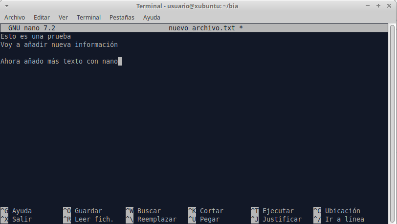

## 3.4. Manipulación de archivos <a name="ficheros"><a/>  

> Ir al [Índice](#indice)

Lo primero que debemos saber es que hay 2 grandes tipos de archivos que nos conciernen en este punto: 

- **Texto plano**: el contenido del archivo es directemente legible por un humano. Un ejemplo de este tipo de archivos sería los de tipo _txt_, _csv_, _tsv_ y muchos otros que se usan en secuenciación masiva para almacenar las secuencias (_fasta_, _fastq_, _sam_, _vcf_, etc.), que los veremos más adelante.  
- **Binarios**: el contenido del archivo sólo es entendible por un humano si se usa un programa especial para abrirlo. Un ejemplo sería un archivo de Microsotf Word (_docx_), cuyo contenido sólo es legible si usamos un editor de texto, ya sea el propio Microsoft Word u otro compatible (ex_ LibreOffice). También son parcialmente binarios los archivos _pdf_, _png_, _jpeg_, etc. Si trataramos de ver el contenido de estos ficheros con un editor de texto plano sólo veríamos una sucesión de caracteres ininteligibles para nosotros/as, pero perfectamente entendibles por un ordenador.  

Otra cosa importante que mencionar es que las extensiones de los archivos (_.txt_, _.pdf_) sólo sirven para que el sistem operativo sepa con qué programa específico debe abrirlos.  

La mayoría de los archivos que vamos a manejar serán de tipo _texto plano_ y a veces estarán comprimidos para ocupar menos espacio (lo que los convierte en binarios).  

Ya hemos visto antes cómo crear un archivo vacío con el comando _touch_, pero hay otra formas de crear archivos, principalmente redirigiendo la salida estándar (_stdout_) de algún comando.  

Cuando ejecutamos un comando en el terminal, si este genera algún tipo de salida, se muestra en la pantalla del terminal, siendo esta la salida estándar por defecto. Utilizando el operados «>» podemos redirigir lo que se muestra por pantalla a un archivo. Para este ejemplo usaremos el comando _echo_ que muestra por pantalla el texto que le demos (también puede mostrar el contenido de una variable):

```bash
cd
cd bia
echo "Esto es una prueba" > nuevo_archivo.txt
```

Ahora podemos comprobar con _ls_ o _tree_ que hemos creado un nuevo archivo. En este caso, a diferencia de los anteriores en los que usamos el comando _touch_ para crearlos, el nuevo archivo no está vacío, lo que podemos comprobar por el espacio que ocupa:

<p align="center" width="100%">
	
</p>

Si quisiéramos añadir algún texto a nuestro archivo de manera rápida podríamos usar también el comando _echo_, pero ahora, en lugar de usar al operador «>», que crearía un nuevo archivo sobre-escribiendo el que ya existe si usamos el mismo nombre, usaremos el operador «>>» que añade el nuevo contenido al archivo existente (si usamos este operador con el nombre de un fichero que no existe, se crear también y se añade el contenido):

```bash
echo "Voy a añadir nueva información" >> nueva_archivo.txt
```

Otra forma de crear, o editar, un archivo desde el terminal es usando diversos editores de texto plano que vienen ya pre-instalador en la _shell_. Los más habituales son _vim_, más antiguo y difícil de manejar pues debes conocer los atajos de teclado para operar, y _nano_ que es más intuitivo. Vamos a ver y editar nuestro archivo con _nano_:

```bash
nano nuevo_archivo.txt

# Añadimos o modificamos lo que queremos
# Para guardar pulsamos ctrl+o
# Para salir pulsamos ctrl+x
```

<p align="center" width="100%">
	
</p>


Como vemos en la parte inferior del editor tenemos una chuleta con los comandos que podemos usar, como guardar, cerrar, cortar y pegar, etc. La tecla _ctrl_ está simbolizada como «^» para ahorrar espacio. 


En lugar de editar un archivo que ya existe podemos crear uno nuevo escribiendo el nombre de un nuevo archivos que no exista:

```bash
nano nuevo_archivo_2.txt
```

Sin embargo, generalmente los archivos que vamos a manejar no son tan simples, por lo que para aprender los comandos más habituales para ver el contenido y analizar el contenido de un fichero de texto plano vamos a utilizar el archivo «countries.csv» (modificado de [aquí](https://simplemaps.com/data/countries)) y que tenéis disponible en la carpeta _/home/usuario/Documentos/_. Para no borrar accidentalmente el archivo vamos a hacernos una copia en una nueva carpeta:

```bash
cd
mkdir countries
cp /home/usuario/Documentos/countries.tsv countries
cd countries
```

Vamos a echar un vistazo al contenido del archivo con el comando _less_, que no muestra el contenido en trozos del tamaño de la ventana del terminal, que podremos ir moviendo con las fechas o con la barra de espacio. 

```bash
less countries
```

Quizás cuesta un poco, pero se puede intuir que estamos ante una tabla, lo que ya se podía intuir por su extensión _tsv_ (_tab separated values_, valores separados por tabuladores). Existe otro tipo de tablas en formato texto plano que sería el _csv_ (_comma separated values_, valores separados por comas), siendo ambos formatos importables en Microsoft Excel (o LibreOffice).  

En la visualización en el terminal a veces las columnas están un poco desfasadas dependiendo el tamaño del texto de cada "celda", por lo que no siempre es fácil verlo. En cualquier caso, estamos ante una tabla de paises con varios datos de cada uno de ellos (moneda usado, población, etc.). En la siguiente tabla podemos ver algo mejor las primers líneas del archivo.  

| country       | currency             | population | density | area     | gdp      | language   | driving_side | continent     | un_member | religion     |
|---------------|----------------------|------------|---------|----------|----------|------------|--------------|---------------|-----------|--------------|
| China         | Chinese Yuan         | 1413142846 | 147.2   |  9596960 | 17963170 | Chinese    | right        | Asia          |    TRUE   | No Religion  |
| India         | Indian Rupee         | 1399179585 | 425.6   |  3287263 |  3465541 | Hindi      | left         | Asia          |    TRUE   | Hinduism     |
| United States | United States Dollar |  339665118 | 34.5    |  9833517 | 25744100 | English    | right        | North America |    TRUE   | Christianity |
| Indonesia     | Rupiah               |  279476346 | 146.7   |  1904569 |  1319100 | Indonesian | left         | Asia          |    TRUE   | Islam        |
| Pakistan      | Pakistani Rupee      |  247653551 | 311.1   |   796095 |   326796 | Urdu       | left         | Asia          |    TRUE   | Islam        |
| Nigeria       | Naira                |  230842743 | 249.9   |   923768 |    15414 | English    | right        | Africa        |    TRUE   | Christianity |
| Brazil        | Brazilian Real       |  218689757 |    25.7 |  8515770 |  1920095 | Portuguese | right        | South America |    TRUE   | Christianity |
| Bangladesh    | Bangladeshi Taka     |  167184465 |  1126.1 |   148460 |   432677 | Bengali    | left         | Asia          |    TRUE   | Islam        |
| Russia        | Russian Ruble        |  141698923 |     8.3 | 17098242 |  2240422 | Russian    | right        | Europe        |    TRUE   | Christianity |

Para salir de la visualización del archivo que estamos haciendo con _less_ debemos pulsar la tecla «q» (_quit_) o _ctrl+c_ (_cancel_). 


Si sólo queremos echar un vistazo al inicio del archivo podemos usara el comando _head_, que por defecto nos muestra las primeras 10 líneas, pero que podemos modificar usando la opción _-n_ para mostrar las primeras n líneas que necesitemos:

```bash
head -n 5 countries.tsv

# country	currency	population	density	area	gdp	language	driving_side	continent	un_member	religion
# China	Chinese Yuan	1413142846	147.2	9596960	17963170	Chinese	right	Asia	TRUE	No Religion
# India	Indian Rupee	1399179585	425.6	3287263	3465541	Hindi	left	Asia	TRUE	Hinduism
# United States	United States Dollar	339665118	34.5	9833517	25744100	English	right	North America	TRUE	Christianity
# Indonesia	Rupiah	279476346	146.7	1904569	1319100	Indonesian	left	Asia	TRUE	Islam
```

_tail_ funciona igual que _head_, pero nos mostrará las n últimas líneas (por defecto 10):

```bash
tail -n 5 countries.tsv

# South Georgia and the South Sandwich Islands	Pound Sterling					English	left	Seven seas (open ocean)	FALSE	
# Heard Island and McDonald Islands				412			left	Seven seas (open ocean)	FALSE	
# Bouvet Island				49			right	Antarctica	FALSE	
# Antarctica				14200000				Antarctica	FALSE	No Religion
#
```

Como vemos, sólo nos muestra 4 líneas con contenido porque hay una última línea en blanco al final del archivo.


Podríamos combinar estos comandos, y otros, usando lo que se conoce como _pipes_, o tuberías, que básicamente permiten pasar la salida de un comando al siguiente. Por ejemplo, imaginamos que queremos copiar la información de India, que está en la tercera línea del fichero. Obviamente podríamos abrirlo con _nano_ y copiar la tercera línea, pero no siempre vamos a poder hacer esto por el tamaño de lso archivos, que podrían llegar a no abrirse con _nano_ (o _vim_) o tardarían demasiado. Para hacerlo rápido podemos tomar las 3 primeras líneas con _head_ y luego pasar esas líneas a _tail_ y pedirle que nos devuelva sólo la última. Esto se ehecutaría así:

```bash
head -n 3 countries.tsv | tail -n 1

# India	Indian Rupee	1399179585	425.6	3287263	3465541	Hindi	left	Asia	TRUE	Hinduism
```

Hemos utilizado el operador «|» (_pipe_) para separar los comandos que se escribe pulsando alt+1. Veremos más adelante que podemos combinar muchos comandos usando _pipes_.  


<!-- guardar salida a archivo nuevo -->


<!--
> [!WARNING]
> Las extensiones de los archivos (_.txt_ o _.pdf_) en realidad son sólo una ayuda para que los programas pueden identificar los archivos que pueden abrir. 

			cat (comprimir con gzip, zcat)

Otro comando útil para ver el contenido de lo archivos es _cat_ (_concatenate_, concatenar) que muestra el contenido completo del archivo en la plantalla. Este comando, aunque sirve para ver el contenido, dado que lo muestra por completo es más útil para 

			wc, grep 


			Compresión/descompresión
			# No da tiempo cut, sed, sort, uniq, awk, etc....


Permisos???
-->
