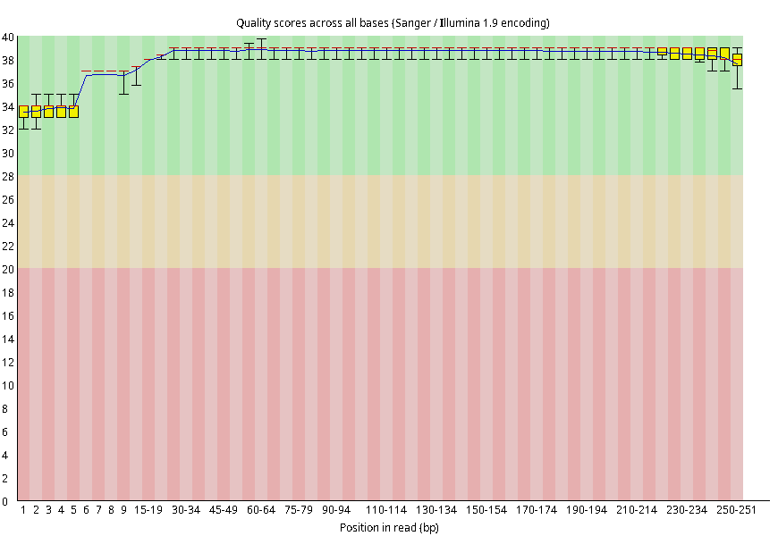

# Índice <a name="indice"></a>

1. [Descarga de datos NGS](#datos)
2. [Análisis de calidad de las secuencias](#calidad)  
3. [Filtrado de calidad](#filtrado)  
4. [Ensamblaje del genoma](#assembly)
5. [Comparación de ensamblaje](#quast)
6. [Annotación del genoma](#annot)
7. [Análisis de variantes](#variantes)
<!--8. [Tarea](#tarea) 
-->


***

# 1. Descarga de datos NGS <a name="datos"></a> 

Descargamos de las bases de datos (SRA/ENA) los datos que nos interesan desde las webs o utilizando el comando _fasterq-dump_:

> Voy a utilizar los mismos datos que descargamos en la presentación de las bases de datos. 

```bash
conda activate ngs
mkdir datos
cd datos
fasterq-dump --split-files SRR34798504
# conda deactivate
```

> No desactivo el entorno de conda porque vamos a seguir utilizando, pero no olvidéis activarlo para usarlo y al finalizar desactivarlo.  

Los datos también podéis encontrarlos en la carpeta _/home/usuario/Documentos/_, así que en lugar de descargarlos de nuevo, también podéis hacer un enlace simbólico a la carpeta en la que queremos usarlos como vimos anteriorment:

```bash
mkdir datos
cd datos
ln -s /home/usuario/Documentos/SRR34798504_1.fastq .
ln -s /home/usuario/Documentos/SRR34798504_2.fastq .
```

Si descargáis los datos de ENA estarán comprimidos y aunque todos los programas que vamos a utilizar ya admiten archivos comprimidos, para seguir mejor el tutorial y que no haya confusiones con los nombres de archivos es recomendable que los descomprimáis:

```bash
gunzip SRR34798504_1.fastq.gz
gunzip SRR34798504_2.fastq.gz
```

**Comprobación de la integridad de los datos descargados**

Una forma simple de comprobar que los datos se han descargado correctamente es contar el número de lecturas que tiene cada fichero, que debe ser el mismo en ambos y además coincidir con la información de la base de datos:

```bash
wc -l ECTV_R1.fastq
wc -l ECTV_R2.fastq
```

La opción *-l* nos permite contar el número de líneas del fichero y como sabemos que cada secuencia en el formato fastq está representado por 4 líneas, dividiendo ese número entre 4 nos dará el número de secuencias en el archivo. Esto también se puede hacer si combinamos el comando _wc_ con _gawk_:  

```bash
wc -l ECTV_R1.fastq | gawk '{print $1/4}'
wc -l ECTV_R2.fastq | gawk '{print $1/4}'
```
Otra opción más segura sería utilizar el algoritmo [MD5sum](https://en.wikipedia.org/wiki/Md5sum) u otros más modernos ([SHA1sum](https://en.wikipedia.org/wiki/Sha1sum)) que ["transforman"](https://en.wikipedia.org/wiki/Cryptographic_hash_function) el contenido de un fichero en una cadena de caracteres denomicado _hash_, que no cambian a menos que el contenido del archivo cambie (el nombre del archivo es irrelevante para esto, sólo importa el contenido). Por lo tanto, si durante la descarga los datos se han corrompido por alguna razón, el hash cambiará. Por ello, es muy frecuente que las bases de datos proporcionen este tipo de hashes para que podamos realizar esta comprobación. 

Si utilizamos _fasterq-dump_ para la descarga, ya hace la comprobación internamente.  

Pero si nos hemos descargado los datos del ENA debemos comprobar que la descarga ha ido bien. Los hashes de los ficheros originales obtenidos de ENA son:

| File | MD5 |
| --- | --- |
| SRR34798504_1.fastq.gz | 0fbf0a561e66c4abe58e389e75bac35f |
| SRR34798504_2.fastq.gz | 52398fd436e6802a335e8d663e8c00c6 |

Para 
```bash
md5sum SRR34798504_1.fastq.gz
md5sum SRR34798504_2.fastq.gz

# o, podemos hacer simplemente:
# md5sum *.fastq.gz
```

> En Mac el comando *md5sum* se llama simplemente *md5*

Finalmente, echando un simple vistado a los últimos dígitos del hash podemos ver si todo ha ido bien o no, porque de no ir bien, los hashes cambian completamente. 

> [!IMPORTANT]
> Un fichero comprimido tiene un hash diferente que el mismo fichero sin comprimir. El teoría el contenido será el mismo, pero en el no comprimido será texto plano, mientras que en el comprimido estará codificado en binario.  

<!--
Aquí les podríamos explicar bucles for
-->

# 2. Análisis de calidad de las secuencias <a name="calidad"></a> 

Para realizar el análisis de la calidad de las lecturas usaremos el programa [FastQC](https://www.bioinformatics.babraham.ac.uk/projects/fastqc/)


```bash
mkdir Quality
fastqc SRR34798504_1.fastq -o Quality/
fastqc SRR34798504_2.fastq -o Quality/
```

En la carpeta _Quality_ encotraremos 2 ficheros _html_ con el resultado del análisis.  

<p align="center">Calidad R1</p>
<p align="center" width="75%">
  
</p>
<p align="center">Calidad R2</p>
<p align="center" width="75%">
  
</p>


# 3. Filtrado de calidad <a name="filtrado"></a> 

Hay muchos programas para realizar el filtrado de calidad, como [CutAdapt](https://cutadapt.readthedocs.io/en/stable/), [FastX](http://hannonlab.cshl.edu/fastx_toolkit/), [Trimmomatic](http://www.usadellab.org/cms/?page=trimmomatic), etc. Todos son muy similares, pero el último es muy rápido y sencillo de usar, por lo que usaremos este. 

```bash
trimmomatic PE -phred33 \
  SRR34798504_1.fastq \
  SRR34798504_2.fastq \
  SRR34798504_1_qf_paired.fastq \
  SRR34798504_1_qf_unpaired.fastq \
  SRR34798504_2_qf_paired.fastq \
  SRR34798504_2_qf_unpaired.fastq \
  SLIDINGWINDOW:4:30 MINLEN:125 LEADING:30 TRAILING:30 AVGQUAL:30
```

> STDOUT:
> TrimmomaticPE: Started with arguments:  
>  -phred33 SRR34798504_1.fastq SRR34798504_2.fastq SRR34798504_1_qf_paired.fastq SRR34798504_1_qf_unpaired.fastq SRR34798504_2_qf_paired.fastq SRR34798504_2 qf_unpaired.fastq SLIDINGWINDOW:4:30 MINLEN:125 LEADING:30 TRAILING:30 AVGQUAL:30  
> Multiple cores found: Using 2 threads  
> Input Read Pairs: 30002 Both Surviving: 18858 (62,86%) Forward Only Surviving: 3739 (12,46%) Reverse Only Surviving: 990 (3,30%) Dropped: 6415 (21,38%)  
> TrimmomaticPE: Completed successfully  

**Parámetros por defecto de Trimmomatic**
- ILLUMINACLIP:TruSeq3-PE.fa:2:30:10 \
- LEADING:3 \
- TRAILING:3 \
- SLIDINGWINDOW:4:15 \
- MINLEN:36

**Descripción de los parámetros de Trimmomatic**
- ILLUMINACLIP: Cut adapter and other illumina-specific sequences from the read.
- SLIDINGWINDOW: Performs a sliding window trimming approach. It starts scanning at the 5‟ end and clips the read once the average quality within the window falls below a threshold.
- MAXINFO: An adaptive quality trimmer which balances read length and error rate to maximise the value of each read
- LEADING: Cut bases off the start of a read, if below a threshold quality
- TRAILING: Cut bases off the end of a read, if below a threshold quality
- CROP: Cut the read to a specified length by removing bases from the end
- HEADCROP: Cut the specified number of bases from the start of the read
- MINLEN: Drop the read if it is below a specified length
- AVGQUAL: Drop the read if the average quality is below the specified level
- TOPHRED33: Convert quality scores to Phred-33
- TOPHRED64: Convert quality scores to Phred-64

Ahora vamos a volver a chequear la calidad de las secuencias para comprobar la mejora:


```bash
fastqc SRR34798504_1_qf_paired.fastq -o Quality/
fastqc SRR34798504_2_qf_paired.fastq -o Quality/
```

<p align="center">Calidad R1</p>
<p align="center" width="75%">
  
</p>
<p align="center">Calidad R2</p>
<p align="center" width="75%">
  
</p>

Podemos observar una clara mejora, especialmente en la R2. 

# 4. Ensamblaje del genoma <a name="assembly"></a> 

Para el ensamblaje de l genoma vamos a utilizar [SPAdes](https://github.com/ablab/spades), uno de los más populares basados en gráfos de *de Bruijn*. 

SPAdes tiene diferentes modos en función del tipo de experimento (*--sc*, para datos de experimentos de _single cell_ *--meta*; para datos de metagenómica; --isolate, para datos de la secuenciación de un único organismo con mucha profundidad de secuencia o *--rna*, para ensamblaje de datos de RNA-seq). Además, tiene el modo _--careful_ que es el recomendado para el ensamblaje de genomas pequeños (bacterias/virus sin mucha profundidad de secuencia) que incluye un para de corrección de errores en las lecturas (_MismatchCorrector_) que mejora la calidad del ensamblaje.  

En nuestro caso estamos intentando ensamblar el genoma de SARS-CoV2, de ~30 Kb, y después de la limpieza de calidad tenemos ~18.000 lecturas pareadas (vamos a suponer que tienen ~200 nt de longitud), por lo tanto, tendríamos una cobertura de 18.000 lecturas \* 200  nt \* 2 pares \\ 30.000 nt de longitud de genoma \= 240X, es decir, en teoría hemos leido cada base del genoma 240 veces. Es una muy buena cobertura, quizás incluso excesiva. Por lo tanto, vamos a utilizar 2 modos de SPAdes. Por un lado usaremos el modo _--careful_ que es el recomendado para genomas pequeños, y también aplicaremos el modo _--isolate_ que esté especialmente diseñado para ensamblar genomas con alta cobertura. Finalmente nos quedaremos con el mejor ensamblaje.  

Ejecutamos SPAdes en moco _careful_:

```bash
spades.py --careful -t 2 -1 SRR34798504_1_qf_paired.fastq -2 SRR34798504_2_qf_paired.fastq -o careful
```

> \-t es el números de cores/procesadores que queremos usar.  

Ya al final de la ejecución nos advierte de que quizás deberíamos usar _--isolate_:

> Your data seems to have high uniform coverage depth. It is strongly recommended to use --isolate option.

Ejecutamos SPAdes en moco _isolate_:

```bash
spades.py --isolate -t 2 -1 SRR34798504_1_qf_paired.fastq -2 SRR34798504_2_qf_paired.fastq -o isolate
```

Dentro de las carpetas de los ensamblajes encontraremos varios ficheros:

```bash
(ngs) usuario@xubuntu:~/datos/careful$ l
total 520K
-rw-rw-r-- 1 usuario usuario  32K sep 16 10:28 assembly_graph_after_simplification.gfa
-rw-rw-r-- 1 usuario usuario  64K sep 16 10:28 assembly_graph.fastg
-rw-rw-r-- 1 usuario usuario  32K sep 16 10:28 assembly_graph_with_scaffolds.gfa
-rw-rw-r-- 1 usuario usuario  32K sep 16 10:28 before_rr.fasta
-rw-rw-r-- 1 usuario usuario  32K sep 16 10:28 contigs.fasta
-rw-rw-r-- 1 usuario usuario  539 sep 16 10:28 contigs.paths
drwxrwxr-x 3 usuario usuario 4,0K sep 16 10:28 corrected
-rw-rw-r-- 1 usuario usuario   59 sep 16 10:28 dataset.info
-rw-rw-r-- 1 usuario usuario  212 sep 16 10:28 input_dataset.yaml
drwxrwxr-x 4 usuario usuario 4,0K sep 16 10:28 K127
drwxrwxr-x 4 usuario usuario 4,0K sep 16 10:28 K21
drwxrwxr-x 4 usuario usuario 4,0K sep 16 10:28 K33
drwxrwxr-x 4 usuario usuario 4,0K sep 16 10:28 K55
drwxrwxr-x 4 usuario usuario 4,0K sep 16 10:28 K77
drwxrwxr-x 4 usuario usuario 4,0K sep 16 10:28 K99
drwxrwxr-x 2 usuario usuario 4,0K sep 16 10:28 misc
drwxrwxr-x 4 usuario usuario 4,0K sep 16 10:28 mismatch_corrector
-rw-rw-r-- 1 usuario usuario 1,5K sep 16 10:28 params.txt
drwxrwxr-x 2 usuario usuario 4,0K sep 16 10:28 pipeline_state
-rw-rw-r-- 1 usuario usuario 3,7K sep 16 10:28 run_spades.sh
-rw-rw-r-- 1 usuario usuario 8,3K sep 16 10:28 run_spades.yaml
-rw-rw-r-- 1 usuario usuario  32K sep 16 10:28 scaffolds.fasta
-rw-rw-r-- 1 usuario usuario  539 sep 16 10:28 scaffolds.paths
-rw-rw-r-- 1 usuario usuario 210K sep 16 10:28 spades.log
drwxrwxr-x 2 usuario usuario 4,0K sep 16 10:28 tmp
-rw-rw-r-- 1 usuario usuario  317 sep 16 10:28 warnings.log
```

Los que nos interesan principalmente son 2:

- contigs.fasta: que contiene los _contigs_, fragmentos de secuencia que ha conseguido ensamblar.  
- scaffolds.fasta: que contiene los _scaffolds_ que ha conseguido construir uniendo _contigs_.  

En el caso de los genomas virales no suele haber apenas diferencia entre ambos ficheros, ya que si el ensamblaje se rompe y no puede ser completado, suele ser por repeticiones o zonas muy difíciles de secuenciar (muy alto contenido en GC o muy bajo, mutaciones, etc.), por lo que unir esos trozos con la información de las lecturas pareadas también suele ser complicado y no se generan scaffolds.  

# 5. Comparación de ensamblaje <a name="quast"></a> 

Dado que existe un genoma de referencia de SARS-CoV2 podríamos alinear nuestros _contigs/scaffolds_ de ambos ensamblajes con _Blast_ y determinar "manualmente" cual es el mejor ensamblaje (y quizás en este caso sería más o menos factible por su reducido tamaño), sin embargo, en la mayoría de los casos no vamos a poder hacer este tipo de comprobaciones manuales. Por ello, se crearon herramientas como [QUAST](https://quast.sourceforge.net/) que nos permite comparar nuestros ensamblajes de forma sencilla y rápida. Además, de usar en línea de comandos, también hay una versión web que se puede utilizar si los datos que tenemos no son muy grandes. Aquí usaremos la línea de comandos. 

Antes de empezar vamos a descargar el genoma de referencia de SARS-CoV2 paa usarelo como referencia para la comparación. Utilizaremos [Entrez Direct](https://www.ncbi.nlm.nih.gov/books/NBK179288/), una herramienta de NCBI que nos permite descargar datos mediante la línea de comandos:

```bash
esearch -db nucleotide -query "NC_045512" | efetch -format fasta > NC_045512.fasta
```

> También podemos ir a NCBI y descargar la secuencia manualmente, pero pensad que normalmente no tenemos acceso a la máquina en la que estamos trabajando mediante una interfaz gráfica (GUI), sino que sólo tenemos acceso mediante línea de comandos (CLI).

> Si la descarga tarda mucho, podemos copiar/mover el genoma de referencia de la carpeta _/home/usuario/Documentos/_  

Ahora vamos a crear una carpeta para los análisis y haremos unos enlaces simbólicos de los ficheros que necesitamos:

```bash
mkdir quast
cd quast
ln -s /home/usuario/datos/careful/contigs.fasta contigs_careful.fasta
ln -s /home/usuario/datos/careful/scaffolds.fasta scaffolds_careful.fasta
ln -s /home/usuario/datos/isolate/contigs.fasta contigs_isolate.fasta
ln -s /home/usuario/datos/isolate/scaffolds.fasta scaffolds_isolate.fasta

ln -s /home/usuario/datos/NC_045512.fasta NC_045512.fasta
```

Finalmente ejecutamos _quast_:

```bash
quast.py contigs* scaffolds* -R NC_045512.fasta
```` 

Obtendremos una fichero _report.html_ que abriremos en el navegador:

<p align="center">Tabla parámetros ensamblajes</p>
<p align="center" width="100%">
  
</p>

En la tabla podemos ver una serie de parámetros: 
- Fracción del genoma: obviamente cuanto mayor sea mejor será el ensamblaje.  
- Alineamiento más largo: cuando más cerca del tamaño del genoma más completo será nuestro ensamblaje.  
- Longitud total alineada: de nuevo, cuanto mayor mejor.   
- NGA50: es el equivalente al N50 pero sólo consideranto los contigs/scaffolds alineadas. N50 se define como la longitud del contigs/scaffolds alineadas que representa el 50% del total de longitud ensamblada cuando ordenamos los contigs por tamaño. Es como una especia de mediana de los tamaños de los contigs, por lo que cuanto mayor sea mejor.  
- LGA50: es el equivalente al L50 pero sólo consideranto los contigs/scaffolds alineadas. L50 es lo mismo que el N50, pero en lugar de contar la longitud, cuenta el número de contigs hasta llegar a ese 50%. En este caso, cuanto menor sea el número de contigs que suman el 50% mejor.  
- etc.

Si nos podemos sobre cada parámetros nos explica lo que es y cómo se ha calculado. También podemos acceder a una versión extendida con otros muchos parámetros. 

En nuestro caso, como podréis comprobar no hay diferencia alguna entre los ensamblajes, son todos iguales, por lo que cualquiera de ellos será válido.

También nos da una representación gráfica de nuestros ensamblajes, basado en la longitud acumulada:

<p align="center">Gráfico longitud acumulada</p>
<p align="center" width="100%">
  
</p>

De nuevo podemos comprobar que ambos ensamblajes, tanto _contigs_ como _scaffolds_, producen el mismo resultado.  

Por último, en la parte superior del _report.html_ encontramos un enlace a _icarus contigs browser_ donde podemos obtener una visualización de cómo alinean _contigs/scaffolds_ frente al genoma de referencia. 

<p align="center">Alineamiento contigs</p>
<p align="center" width="100%">
  
</p>

Podemos comprobar que solo los 2 contigs más largos (NODE_1 y NODE_2) alinean frente al genoma de referencia, de un total de 7, como se puede ver la tabla extendida, aunque esos 5 contigs adicionales son menores de 1000 pb. ¿Qué son esos 5 contigs adicionales? Podemos cogerlo y hacer un Blast en la página del NCBI y tratar de identificar a que pertenecen. El resultado es que se parecen mucho a secuencias humanas, por lo que es muy problabe que procedan de pequeñas contaminaciones durante el proceso de preparación de la muestra o durante la secuenciación. También es posible, aunque no ha ocurrido en este caso, que tengamos algún contig que se corresponda con el fago PhiX174. El ADN genómico de este fago se introduce en todas las carreras de Illumina como control interno de la calidad de la secuenciación y aunque las lecturas de este se eliminan antes de darle los resultados a los investigadores, a veces quedan algunas, y que al tratarse de un genoma pequeño (<5kb), con tan sólo algunas pocas lecturas se puede ensamblar. 

Por lo tanto, sólo nos quedaremos con los 2 contigs más largos para futuros análisis. Para ello vamos a utilizar [SeqKit](https://bioinf.shenwei.me/seqkit/):

```bash
cd /home/usuario/datos/
cp ./careful/contigs.fasta .
seqkit seq contigs.fasta -m 1000  > contigs_1kb.fasta
```

> Puede que Seqkit no esté instalado, así que para instalarlo, dentro del entorno _ngs_, haremos _conda install -c bioconda seqkit -y_

# 6. Annotación del genoma <a name="annot"></a> 

Dado que estamos trabajando con una secuencia viral (SARS-CoV2) usaremos un programa específicamente diseñado para la anotación de genomas virales. En este caso usaremos [Prokka](https://github.com/tseemann/prokka):

```bash
conda deactivate
conda activate prokka
prokka -k Viruses contigs_1kb.fasta
conda deactivate
```

> Si el encorno "prokka" no existe lo instalamos así: _conda create -n prokka -c bioconda prokka -y_

Prokka nos devuelve una carpeta (cuyo nombre podemos personalizar con la opción _--outdir_) con varios archivos que podéis explotar. Nos vamos a centrar en 2 principalmente.

- El fichero en formato genbank (.gbk): ya vimos brevemente este formato anteriormente, que es el estándar en NCBI. Podemos verlo como texto plano, que es más o menos legible, pero también podemos utilizar herramientas como [SnapGene viewer](https://www.snapgene.com/snapgene-viewer) (que es gratuito, aunque hay que registrase) o online en [Benching](https://www.benchling.com/) que también tiene una versión gratuita.  
- El fichero [GFF](https://www.ensembl.org/info/website/upload/gff.html) (_gene file format_): este es un formato estándar que utilizan otras muchas bases de datos para almacenar las anotaciones. De nuevo, es más o menos legible/manipulable como texto plano, pero también tenemos algunas herramientas para analizarlo de una forma más visual, como el [IGV](https://igv.org/) (_Integrative Genomics Viewer_).  

<!--Detalles del formato GFF?-->

Para lanzar IGV en Linux usaremos la línea de comandos:

```bash
conda activate ngs
igv
```

Una vez cargado IGV tendremos que cargar nuestro genoma (que son los contigs seleccionados: contigs_1kb.fasta). Damos en el menú "Genome" y luego a "Load Genome from file", buscamos el fichero y le damos a aceptar. Luego debemos cargar el _gff_ con las annotaciones predichas por Prokka. Le damos a "File>Load from file" y buscamos el fichero correspondiente:

<p align="center">Visualización anotaciones</p>
<p align="center" width="100%">
  
</p>

En este caso estamos ante un genoma bastante pequeño, pero podemos explorarlo por contigs y echar un vistazo a cada uno de los genes (o mejor dicho _CDS_, _coding sequences_) que hemos predicho así como su posible función asignada por Prokka en base a la homología de secuencia con proteínas descritas (y que están presentes en las bases de datos de Prokka). 

En este punto ya habríamos conseguido obtener un borrador más o menos completo del genoma del virus SARS-CoV2 obtenido de una muestra/paciente. A partir de aquí los análisis continuarán según los intereses iniciales planteados. Por ejemplo, si este fuera una cepa muy virulenta sería interesante analizar los cambios presentes en este genoma con respecto a la secuencia de referencia (la cepa original de Wuhan) y a que proteínas está afectando.  

# 7. Análisis de variantes <a name="variantes"></a> 

**Alinemianto de lecturas**

Si nuestro interés es detectar variantes en la cepa/aislado que estamos analizando con respecto a la de referencia, en lugar de ensamblar el genoma tendremos que alinear las lecturas de nuestra cepa frente al genoma de referencia. Para ello utilizaremos el alineador de lecturas cortas [Bowtie2](https://bowtie-bio.sourceforge.net/bowtie2/manual.shtml). Existe otro alineador similar, también muy utilizado, llamado [BWA](https://github.com/lh3/bwa), que está basado en el mismo algoritmo ([la transformación de Burrows-Wheeler](https://en.wikipedia.org/wiki/Burrows%E2%80%93Wheeler_transform)) que es más rápido, pero Bowtie2 es más sencillo de usar y sus parámetros son más sencillos de manejar. 

Antes de alinear las lecturas deberemos generar el índice con el genoma de referencia (es decir, convertir el genoma de referencia en una base de datos usando la transformación de Burrows-Wheeler):

```bash
# conda activate ngs
# cd /home/usuario/datos/
bowtie2-build NC_045512.fasta wuhan
```

Simplemente le damos el genoma de referencia en formato _fasta_ y le damos un nombre al índice (yo he usado wuhan, pero podría ser cualquiera).  

Ahora vamos a alinear las lecturas ya filtradas con Trimmomatic:

```bash
bowtie2 -x wuhan -1 SRR34798504_1_qf_paired.fastq -2 SRR34798504_2_qf_paired.fastq -S aligment.sam

# 18858 reads; of these:
#   18858 (100.00%) were paired; of these:
#     2292 (12.15%) aligned concordantly 0 times
#     16566 (87.85%) aligned concordantly exactly 1 time
#     0 (0.00%) aligned concordantly >1 times
#     ----
#     2292 pairs aligned concordantly 0 times; of these:
#       2130 (92.93%) aligned discordantly 1 time
#     ----
#     162 pairs aligned 0 times concordantly or discordantly; of these:
#       324 mates make up the pairs; of these:
#         256 (79.01%) aligned 0 times
#         68 (20.99%) aligned exactly 1 time
#         0 (0.00%) aligned >1 times
# 99.32% overall alignment rate
``` 

El alineamiento se genera en formato [_sam_](https://en.wikipedia.org/wiki/SAM_(file_format)) (_Sequence Alignment Map_) que podemos abrir y ver su estructura:

```bash
@HD VN:1.5  SO:unsorted GO:query  
@SQ SN:NC_045512.2  LN:29903  
@PG ID:bowtie2  PN:bowtie2  VN:2.5.4  CL:"/home/usuario/miniconda3/envs/ngs/bin/bowtie2-align-s --wrapper basic-0 -x wuhan -S aligment.sam -1 SRR34798504_1_qf_paired.fastq -2 SRR34798504_2_qf_paired.fastq"  
SRR34798504.2 81  NC_045512.2 5486  42  251M  = 5114  -623  TTAGATTCTTGCAAAAGAGTCTTGAACGTGGTGTGTAAAACTTGTGGACAACAGCAGACAACCCTTAAGGGTGTAGAAGCTGTTATGTACATGGGCACACTTTCTTATGAACAATTTAAGAAAGGTGTTCAGATACCTTGTACGTGTGGTAAACAAGCTACAAAATATCTAGTACAACAGGAGTCACCTTTTGTTATGATGTCAGCACCACCTGCTCAGTATGAACTTAAGCATGGTACATTTACTTGTGC HHHBHHHHHHHHHHGHHHHHHHHHHHGHHGGHHHHHHHHGHHHHHHHHHHHHHHHHHGGGHGHHHHHHGGHHHHHHHHHHHHHHHHHHHHHHGHHHGHHHHHHHHHHHGHHHHHHHHHHHHHHGHHFHHGHHHGFHGHGHHHGGHHHGHHHHHHHHHHGHHHHHHHHHHHHHHHHHHHHHHHHHGBGHHHHHHHHHHHHHHHHHHGEGGGHHHHHHHHGHHHHHHHHHHGGGGFGGGGGFFFFFCBBBBBA AS:i:0  XN:i:0  XM:i:0  XO:i:0  XG:i:0NM:i:0  MD:Z:251  YS:i:0  YT:Z:DP  
SRR34798504.2 161 NC_045512.2 5114  42  251M  = 5486  623 ACATTTTATGTTTTACCTAATGATGACACTCTACGTGTTGAGGCTTTTGAGTACTACCACACAACTGATCCTAGTTTTCTGGGTAGGTACATGTCAGCATTAAATCACACTAAAAAGTGGAAATACCCACAAGTTAATGGTTTAACTTCTATTAAATGGGCAGATAACAACTGTTATCTTGCCACTGCATTGTTAACACTCCAACAAATAGAGTTGAAGTTTAATCCACCTGCTCTACAAGATGCTTATTA BCCBCFFFFFFFGGGGGGGGGGHHGHHHHHHHHHGHHHHHFHHGHHHHFGGHHHHHHHHHGGGGGHHHHHHHGHFHHHHHHHHHFEFHHHHHHHHHHHHHHHHHHHHHHHHHHHHFGGHHHHHHGHHHHGFHHFHHHHHGFHHHHHHHFHGHHHHHHFCFHHGGHHHHGFHHHGDHHEHHGHHGHHFFHHHHHHHHBHHHHHHHHGFFHHHGHHGGHHHHHHHFHFFHHGHGHHGHHHHHGEHBFFH0GFF AS:i:0  XN:i:0  XM:i:0  XO:i:0  XG:i:0NM:i:0  MD:Z:251  YS:i:0  YT:Z:DP  
```
Las primeras líneas del fichero, aquellas que empiezan por "\@"" son la cabecera, y en ellas suele haber información sobre el genoma de referencia y sobre los parámetros del alineamiento. En nuestro caso, como es un genoma viral sólo tiene un fragmento, pero si estuviéramos alineando frente a un genoma con múltiples fragmentos (o cromosomas) aparecería una línea por acda fragmento/cromosoma con su longitud (LN). 

El resto de líneas representa el alineamiento de las lecturas, a razón de una línea por lectura. Es un formato tipo table (separado por tabuladores) con los siguientes elementos:

| Col | Nombre | Descripción                                                       |
|-----|--------|-------------------------------------------------------------------|
| 1   | QNAME  | Nombre de la secuencia                                            |
| 2   | FLAG   | Bitwise FLAG                                                      |
| 3   | RNAME  | Nombre de la secuencia de referencia con la que alinea            |
| 4   | POS    | Posición de inicio del alineamiento                               |
| 5   | MAPQ   | Calidad el alinemiento de la lectura                              |
| 6   | CIGAR  | CIGAR                                                             |
| 7   | RNEXT  | Secuencia de referencia en la que alinea su par (si tiene)        |
| 8   | PNEXT  | Posición en la que alinear su par (si tiene)                      |
| 9   | TLEN   | Longitud del fragmento (de un par al otro)                        |
| 10  | SEQ    | Secuencia de la lectura                                           |
| 11  | QUAL   | Calidad de la secuencia en Phred33                                |


El [Bitwise FLAG](https://en.wikipedia.org/wiki/SAM_(file_format)#Bitwise_flags) es un número resultado de la transformación de una cadena de 12 bit (que toman sólo valores 0, 1) a decimal. Cada uno de los bits representa una caracteristica del alineamiento. Por ejemplo, el último bit activado (valor 1) significa que la lectura es pareada, el penúltimo estará activado si el par de la lectura alinea correctamente, etc. Una ver asignados todos los bits obtenemos una cadena del tipo "000001000011" que al convertir en decimal da el valor 67 cuyo significado podemos comprobar [aquí](https://broadinstitute.github.io/picard/explain-flags.html) :

<p align="center">Bitwise FLAG</p>
<p align="center" width="100%">
  
</p>

Por otro lado tenemos el [CIGAR](https://en.wikipedia.org/wiki/Sequence_alignment#Representations), que es una representación comparta de cómo alinea la lectura. Por ejemplo, nuestras 2 primeras lecturas tiene un CIGAR de 251M, lo que significa que alinean completamente (251 nt "Match"). Este otro CIGAR, 218M26D32M, indica que la lectura alinea por 218 nt, luego tiene una deleción de 26 nt y luego vuelve a alinear 32 nt. Así podemos representas deleciones (D), inserciones (I) y otras casuísticas de forma muy compacta.  


Existe más columnas en el formato _sam_ (de la 12 en adelante) que son específicas del programa de alineamiento que se haya usado. En el [manual de Bowtie2](https://bowtie-bio.sourceforge.net/bowtie2/manual.shtml#some-sam-flags-describe-paired-end-properties) podéis encontrar la descripción de estos campos adicionales.  


Ahora que ya tenemos las lecturas alineadas podemos echar un vistazo al alineamiento usando IGV, pero antes debemos convertir el alineamiento a formato _bam_ (que es los mismo que _sam_ pero en binario), ordenarlo e indexarlo. Para ello usaremos [_samtools_](https://www.htslib.org/):

```bash
# conda activate ngs
# conda install -c bioconda samtools -y
samtools view -bS aligment.sam > aligment.bam
samtools sort aligment.bam -o aligment_sort.bam
rm -fr aligment.bam 
mv aligment_sort.bam aligment.bam
samtools index aligment.bam
```

Ahora abrimos IGV, cargamos un nuevo genoma, en este caso el de referencia ("Genome>Load genome from file", y luego cargamos el fichero _bam_ con el alineamiento ("File>Load from file"). Además, pllodemos también descarganos las anotaciones del genoma de referencia en formata _gff_ y añadirlo a IGV:

```bash
esearch -db nucleotide -query "NC_045512" | efetch -format gff3 > NC_045512.gff
```

Lo cargamos en IGV ("File>Load from file"):

<p align="center">Alineamiento en IGV</p>
<p align="center" width="100%">
  
</p>


En el visualizador podemos ver las posiciones en las que se han detectado cambios (variantes: SNPs o INDELs) en nuestra muestra con respecto al genoma de referencia (son las barritar verticales de colores en el gráfico de cobertura). Podemos clickar en cada una de las variantes detectadas para ver sus parámetros (número de lecturas totales, número de veces que se ha leído la variante o la base de referencia, etc.). Obviamente, si queremos analizar todas las variantes no vamos a ir mirando de una en una en el visualizador. 

Para analizar las variantes en un alineamiento de secuencias existen muchos programas (GATK, freebayes, etc.) y usaremos uno u otro en función de nuestro diseño experimental. En nuestro caso, que estamos trabajando con secuencias virales usaremos [LoFreq](https://csb5.github.io/lofreq/) que tiene un modo de detección de variantes sin asumir ningún tipo de ploidía. 

Para ejecutar LoFreq tendremos que hacer lo siguientes:


```bash
# conda deactivate
# conda create -n lofreq -c bioconda lofreq -y
# conda activate lofreq

#--Probabilistic realignment of your already mapped reads, which corrects mapping errors
lofreq viterbi -f NC_045512.fasta -o aligment_viterbi.bam aligment.bam

#--Insert indel qualities
lofreq indelqual --dindel -f NC_045512.fasta  -o aligment_viterbi_indelqual.bam aligment_viterbi.bam 

samtools sort aligment_viterbi_indelqual.bam -o aligment_viterbi_indelqual_sort.bam
samtools index aligment_viterbi_indelqual_sort.bam

#--Variant calling
lofreq call-parallel --pp-threads 2 --call-indels -f NC_045512.fasta -o sars.vcf aligment_viterbi_indelqual_sort.bam

```

Obtendremos un fichero en formato [VCF](https://en.wikipedia.org/wiki/Variant_Call_Format) con la información de cada una de las variasntes que ha detectado:

**Formato VCF**

> ##fileformat=VCFv4.0
> ##FILTER=<ID=PASS,Description="All filters passed">
> ##fileDate=20250916
> ##source=lofreq call --call-indels -f NC_045512.fasta --no-default-filter -r NC_045512.2:1-7475 -o /tmp/lofreq2_call_parallelg2gl9izh/0.vcf.gz aligment_viterbi_indelqual_sort.bam 
> ##reference=NC_045512.fasta
> ##INFO=<ID=DP,Number=1,Type=Integer,Description="Raw Depth">
> ##INFO=<ID=AF,Number=1,Type=Float,Description="Allele Frequency">
> ##INFO=<ID=SB,Number=1,Type=Integer,Description="Phred-scaled strand bias at this position">
> ##INFO=<ID=DP4,Number=4,Type=Integer,Description="Counts for ref-forward bases, ref-reverse, alt-forward and > alt-reverse bases">
> ##INFO=<ID=INDEL,Number=0,Type=Flag,Description="Indicates that the variant is an INDEL.">
> ##INFO=<ID=CONSVAR,Number=0,Type=Flag,Description="Indicates that the variant is a consensus variant (as opposed to > a low frequency variant).">
> ##INFO=<ID=HRUN,Number=1,Type=Integer,Description="Homopolymer length to the right of report indel position">
> ##FILTER=<ID=min_snvqual_48,Description="Minimum SNV Quality (Phred) 48">
> ##FILTER=<ID=min_indelqual_37,Description="Minimum Indel Quality (Phred) 37">
> ##contig=<ID=NC_045512.2>
> ##FILTER=<ID=min_snvqual_46,Description="Minimum SNV Quality (Phred) 46">
> ##FILTER=<ID=min_indelqual_35,Description="Minimum Indel Quality (Phred) 35">
> ##FILTER=<ID=min_snvqual_43,Description="Minimum SNV Quality (Phred) 43">
> ##FILTER=<ID=min_indelqual_33,Description="Minimum Indel Quality (Phred) 33">
> ##FILTER=<ID=min_snvqual_49,Description="Minimum SNV Quality (Phred) 49">
> ##FILTER=<ID=min_snvqual_47,Description="Minimum SNV Quality (Phred) 47">
> ##FILTER=<ID=min_snvqual_50,Description="Minimum SNV Quality (Phred) 50">
> ##bcftools_concatVersion=1.22+htslib-1.22.1
> ##bcftools_concatCommand=concat -a -O z -o /tmp/lofreq2_call_parallelg2gl9izh/concat.vcf.gz /tmp/lofreq2_call_> parallelg2gl9izh/0.vcf.gz /tmp/lofreq2_call_parallelg2gl9izh/1.vcf.gz /tmp/lofreq2_call_parallelg2gl9izh/2.vcf.gz /> tmp/lofreq2_call_parallelg2gl9izh/3.vcf.gz /tmp/lofreq2_call_parallelg2gl9izh/4.vcf.gz /tmp/lofreq2_call_> parallelg2gl9izh/5.vcf.gz /tmp/lofreq2_call_parallelg2gl9izh/6.vcf.gz; Date=Tue Sep 16 15:31:55 2025
> ##FILTER=<ID=min_dp_10,Description="Minimum Coverage 10">
> ##FILTER=<ID=sb_fdr,Description="Strand-Bias Multiple Testing Correction: fdr corr. pvalue > 0.001000">
> ##FILTER=<ID=min_snvqual_57,Description="Minimum SNV Quality (Phred) 57">
> ##FILTER=<ID=min_indelqual_45,Description="Minimum Indel Quality (Phred) 45">
> #CHROM  POS ID  REF ALT QUAL  FILTER  INFO
> NC_045512.2 241 . C T 401 PASS  DP=11;AF=1;SB=0;DP4=0,0,6,5
> NC_045512.2 670 . T G 4727  PASS  DP=140;AF=1;SB=0;DP4=0,0,98,42
> NC_045512.2 897 . C A 13908 PASS  DP=386;AF=1;SB=0;DP4=0,0,180,206
> NC_045512.2 2790  . C T 287 PASS  DP=10;AF=1;SB=0;DP4=0,0,4,6
> NC_045512.2 3037  . C T 965 PASS  DP=26;AF=1;SB=0;DP4=0,0,13,13
> NC_045512.2 3330  . C T 57  PASS  DP=10;AF=0.2;SB=0;DP4=5,3,1,1
> NC_045512.2 3431  . G T 367 PASS  DP=10;AF=1;SB=0;DP4=0,0,5,5
> NC_045512.2 3565  . T C 1781  PASS  DP=49;AF=1;SB=0;DP4=0,0,33,16
> NC_045512.2 4184  . G A 13698 PASS  DP=374;AF=1;SB=0;DP4=0,0,250,124
> NC_045512.2 4321  . C T 18588 PASS  DP=510;AF=0.998039;SB=0;DP4=0,1,248,261


LoFreq aplica una seria de filtros de calidad para determinar si una variantes es real o podría ser un artefacto generado por falta de calidad de las lecturas o por alineamientos errores, etc. Aún así, podríamos aplicar filtros adicionales utilizando [vcftools](https://vcftools.sourceforge.net/). 

***